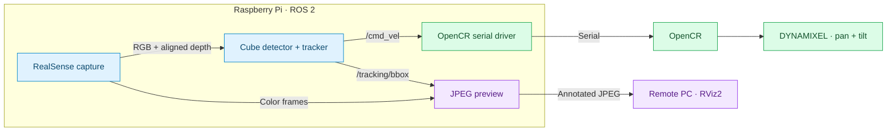

<div align="center">

# ROS-Vision-Tracker

### See the cube. Follow the motion.

A depth-aware, two-axis camera tracker built with ROS 2 and Raspberry Pi.

**KANT PA 1기 · Project 1 · Team xmen**


**[Quick start](#quick-start)** · **[Architecture](#architecture)** · **[Demo](#demo)** · **[Performance](#performance-snapshot)** · **[Documentation](#documentation)** · **[Releases](https://github.com/hsmint/ROS-Vision-Tracker/releases)**

</div>

---

ROS-Vision-Tracker finds a blue cube and keeps it in view. An Intel RealSense camera captures
color and aligned depth on a Raspberry Pi; the tracker checks color, physical
size, and shape, then bridges brief occlusions with CSRT. An OpenCR board drives
two DYNAMIXEL servos to aim the camera. An optional remote PC displays the
annotated image and robot model in RViz2.

## Highlights

| 🔎 Depth-aware detection | 🎯 Pan & tilt tracking | 🖥️ Remote visualization |
| :--- | :--- | :--- |
| HSV color, real-world size, and shape checks help select the blue cube. | Independent velocity commands drive two axes, with automatic homing on startup. | Annotated JPEG preview and an RViz2 robot model keep tracking visible from a second machine. |

| 🧩 Occlusion handling | 📼 Record & replay | 🍓 Runs on the Pi |
| :--- | :--- | :--- |
| CSRT bridges brief gaps in detection. | Replay synchronized color and depth bags for offline analysis. | Capture, tracking, and control continue without a remote PC. |

## Architecture



The default launch targets **30 Hz image publication**, **20 Hz tracking**, and
**20 Hz commands**. The separate JPEG preview targets **5 Hz**. These are
configured rates; see [Performance](#performance-snapshot) for measured performance and limits.

| Package | Responsibility |
| :--- | :--- |
| [`xmen_tracker`](xmen_tracker/README.md) | RealSense capture, cube detection/tracking, velocity commands, JPEG preview, RViz overlays |
| [`xmen_control`](xmen_control/) | OpenCR serial driver (`control_lite`) and `/joint_states` publication |
| [`xmen_bringup`](xmen_bringup/README.md) | Hardware and remote visualization launch files |
| [`xmen_description`](xmen_description/README.md) | Pan/tilt URDF, CAD meshes, and RViz configuration |
| [`firmware`](firmware/) | OpenCR source and prebuilt ARM64 flashing bundle |

## Demo

<div align="center">

### 🎬 See ROS-Vision-Tracker in action

</div>

#### 🎯 Real-world tracking

https://github.com/user-attachments/assets/06dc1db3-719f-4d2d-9c7e-61715f263b9c

#### 🖥️ Inside RViz2

https://github.com/user-attachments/assets/06f8cf11-2dbd-4d1b-b99b-0d997ce7b2b6

## Prerequisites

### Hardware

- Raspberry Pi running **64-bit Ubuntu 26.04 (ARM64)**
- Intel RealSense depth camera (D435 or similar), connected over USB 3
- ROBOTIS OpenCR 1.0 with two DYNAMIXEL XM430-W350 servos (pan ID 11, tilt ID 12)
- A blue cube target (about 5 cm)
- Optional: a PC on the same network for RViz2 visualization

### Software

- [ROS 2 Lyrical](https://docs.ros.org/en/lyrical/Installation/Ubuntu-Install-Debs.html), installed at `/opt/ros/lyrical`
- [RealSense SDK Python bindings (`pyrealsense2`)](https://github.com/realsenseai/librealsense)
  for the system Python, plus its USB rules. rosdep does not install this one; see
  [REALSENSE.md](xmen_tracker/REALSENSE.md).
- Serial port access for your user (for flashing and for `control_lite`):

  ```bash
  sudo usermod -aG dialout $USER   # then log out and back in
  ```

### Firmware

The prebuilt firmware in [`firmware/opencr.tar.gz`](firmware/opencr.tar.gz)
needs no extra tools. Its flasher, `opencr_ld`, is an ARM64 Linux binary that
only depends on the C library, so it runs on the Pi as is. Flashing from an
x86 PC is not supported with this archive.

Only if you change [`opencr_lite.ino`](firmware/opencr_lite.ino): Arduino IDE
with the [OpenCR board package](https://emanual.robotis.com/docs/en/parts/controller/opencr10/#arduino-ide)
and the `Dynamixel2Arduino` library.

<details>
<summary><strong>Package dependency reference</strong></summary>

These are declared in each `package.xml`; `rosdep` installs them.

| Package | Dependencies |
|---|---|
| `xmen_tracker` | `rclpy`, `sensor_msgs`, `geometry_msgs`, `std_msgs`, `visualization_msgs`, `message_filters`, `cv_bridge`, `tf2_ros_py`, `rcl_interfaces`, `launch`, `launch_ros`, `python3-numpy`, `python3-opencv`, `python3-yaml` |
| `xmen_control` | `rclpy`, `geometry_msgs`, `sensor_msgs`, `python3-serial`, `dynamixel_sdk` |
| `xmen_bringup` | `launch`, `launch_ros`, `rviz2`, `robot_state_publisher`, `joint_state_publisher`, `tf2_ros`, `ros2bag`, `rosbag2_transport`, `rosbag2_storage_default_plugins` |
| `xmen_description` | none (URDF and meshes only) |

</details>

## Quick start

### 1 · Flash the OpenCR

[`firmware/opencr.tar.gz`](firmware/opencr.tar.gz) contains the prebuilt
firmware (`opencr_lite.opencr`) and the flasher (`opencr_ld`, built for ARM64,
so run it on the Pi). Connect the OpenCR over USB, then find its port:

```bash
ls /dev/ttyACM*            # usually /dev/ttyACM0
```

Extract the archive and flash the firmware:

```bash
# From the repository root on the Pi
cd firmware
tar -xf opencr.tar.gz
PORT=/dev/ttyACM0          # the port found above
./opencr_ld $PORT 115200 opencr_lite.opencr
```

If the port gives "permission denied", check the `dialout` prerequisite above.

`control_lite` only works with this firmware. To change it, edit
[`firmware/opencr_lite.ino`](firmware/opencr_lite.ino) and rebuild it in the
Arduino IDE.

### 2 · Set up the Raspberry Pi

Option A uses a prebuilt release and needs no build. Option B builds from source.

<details open>
<summary><strong>Option A · Install a prebuilt release</strong></summary>

Download the `.tar.gz` and `.sha256` from
[Releases](https://github.com/hsmint/ROS-Vision-Tracker/releases):

```bash
# Replace v1.0.0 with the downloaded release version.
sha256sum -c xmen-v1.0.0-ubuntu-26.04-ros-lyrical-arm64.tar.gz.sha256
mkdir -p ~/xmen-v1.0.0
tar -xzf xmen-v1.0.0-ubuntu-26.04-ros-lyrical-arm64.tar.gz -C ~/xmen-v1.0.0
cd ~/xmen-v1.0.0

# One-time: install ROS/system dependencies
sudo apt-get install python3-rosdep
sudo rosdep init   # only if rosdep is not initialized yet
rosdep update --rosdistro lyrical
rosdep install --from-paths dependencies --ignore-src --rosdistro lyrical -y

. install/setup.bash
python3 check-runtime.py   # checks imports; does not open the camera or move motors
```

Extract each new release into a fresh directory to avoid stale files.

</details>

<details>
<summary><strong>Option B · Build from source</strong></summary>

```bash
mkdir -p ~/xmen_ws/src && cd ~/xmen_ws/src
git clone https://github.com/hsmint/ROS-Vision-Tracker.git Xmen
cd ~/xmen_ws
source /opt/ros/lyrical/setup.bash
rosdep install --from-paths src --ignore-src -r -y
colcon build --symlink-install --packages-up-to xmen_bringup
source install/setup.bash
```

</details>

### 3 · Start tracking

On the **Pi**:

```bash
export ROS_DOMAIN_ID=50   # use the same value on both machines
ros2 launch xmen_bringup hardware_launch.py
```

> [!IMPORTANT]
> The motors home on startup, then the camera follows the cube. Use
> `start_control:=false` to run the camera and tracker without moving the motors.

Useful options:

```bash
ros2 launch xmen_bringup hardware_launch.py port:=/dev/ttyACM0      # choose a serial port
ros2 launch xmen_bringup hardware_launch.py start_control:=false   # track without moving motors
ros2 launch xmen_bringup hardware_launch.py image_hz:=15.0         # lower CPU load
```

On the **remote PC** (optional, build from source as in 2B):

```bash
export ROS_DOMAIN_ID=50   # use the same value on both machines
ros2 launch xmen_bringup rviz2_launch.py
```

Both machines must use the same `ROS_DOMAIN_ID` and be able to reach each other
over the network. Tracking keeps running without the PC.

Check the tracker from either machine:

```bash
ros2 topic echo /perception_status   # OK, NO_TARGET, or CAMERA_STALL
ros2 topic echo /target --qos-reliability best_effort
```

To record and replay rosbags, use the RViz options, or set serial-port
overrides, see the [bringup documentation](xmen_bringup/README.md). To tune
detection, see [xmen_tracker](xmen_tracker/README.md) and
[PERCEPTION.md](xmen_tracker/PERCEPTION.md).

## Documentation

| I want to… | Read this |
| :--- | :--- |
| Configure launch options, remote RViz, or bag playback | [Bringup guide](xmen_bringup/README.md) |
| Understand tracker nodes, topics, and commands | [Tracker guide](xmen_tracker/README.md) |
| Tune detection or evaluate recordings | [Perception guide](xmen_tracker/PERCEPTION.md) |
| Set up the camera and Python bindings | [RealSense guide](xmen_tracker/REALSENSE.md) |
| Inspect the robot model and meshes | [Robot description](xmen_description/README.md) |
| Modify the OpenCR firmware | [Firmware source](firmware/opencr_lite.ino) |

## Performance Snapshot

**Raspberry Pi 4** · 640×360 RGB + depth · 60-second sample

| 📷 RGB / Depth | 🎯 Tracking | ⚙️ Commands | 🖥️ Preview |
| :---: | :---: | :---: | :---: |
| **25.85 / 25.86 FPS** | **12.66 Hz** | **13.59 Hz** | **2.00 FPS** |


**Tracker status:** `OK` throughout the sample

## Contributors

<div align="center">

### Team xmen

ROS-Vision-Tracker was developed as **Project 1 for KANT PA 1기**.

<table>
  <tr>
    <td align="center" width="25%">
      <a href="https://github.com/hsmint">
        
      </a>
      <br /><br />
      <strong>SeokMin Hong</strong>
      <br />
      <a href="https://github.com/hsmint">@hsmint</a>
    </td>
    <td align="center" width="25%">
      <a href="https://github.com/chj1319">
        
      </a>
      <br /><br />
      <strong>최형준</strong>
      <br />
      <a href="https://github.com/chj1319">@chj1319</a>
    </td>
    <td align="center" width="25%">
      <a href="https://github.com/heffeekim94-web">
        
      </a>
      <br /><br />
      <strong>김혜민</strong>
      <br />
      <a href="https://github.com/heffeekim94-web">@heffeekim94-web</a>
    </td>
    <td align="center" width="25%">
      <a href="https://github.com/kanichong">
        
      </a>
      <br /><br />
      <strong>이홍주</strong>
      <br />
      <a href="https://github.com/kanichong">@kanichong</a>
    </td>
  </tr>
</table>

</div>

---

<div align="center">

**[Get started](#quick-start)** · **[Explore the docs](#documentation)** · **[Back to top](#ros-vision-tracker)**

</div>
