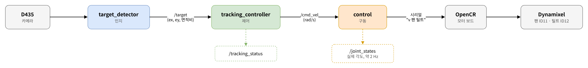
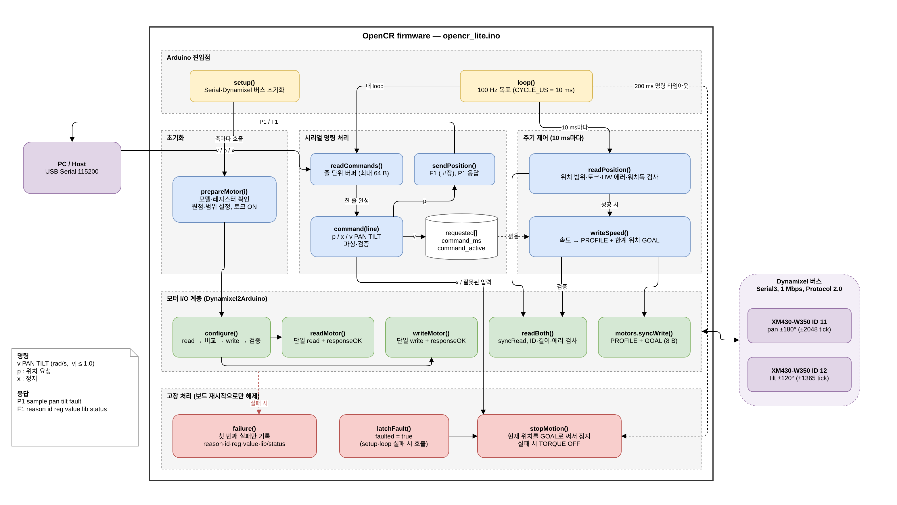
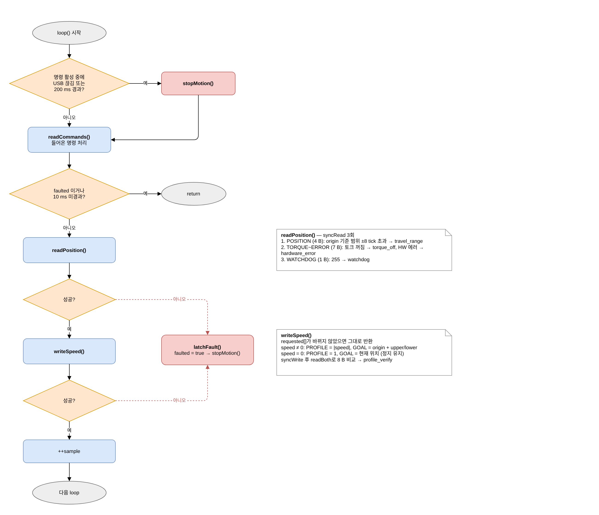
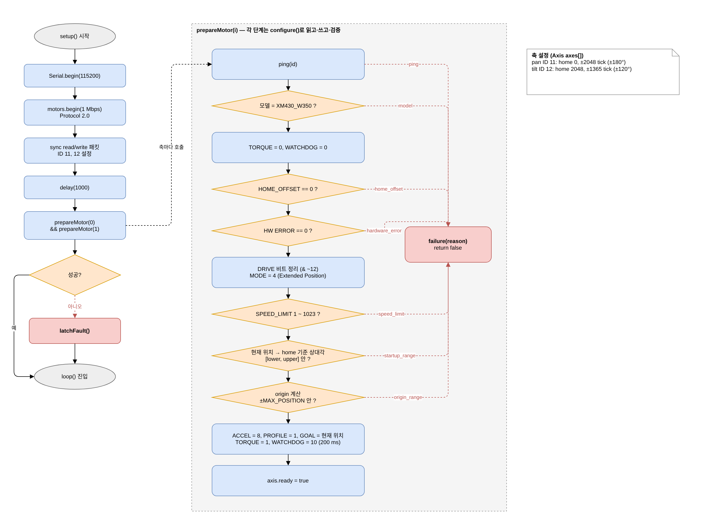
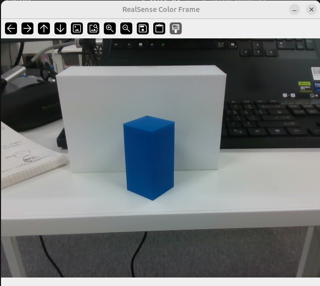

# ROS-Vision-Tracker 통합 보고서 — 팀 Xmen

색으로 구분되는 목표를 RealSense D435로 검출하고, 화면 중심 오차를 팬·틸트 짐벌의 각속도 명령으로 바꿔 목표를 화면 중앙에 두는 시스템이다.

| 장 | 내용 |
| --- | --- |
| 0. 공통 | 장비·전체 흐름, 구동·펌웨어 |
| 1. 문제 1 | 색 기반 검출 — 구현·설정·HSV 근거·조명/거리 측정·해석·한계 |
| 2. 문제 2 | 인터페이스 규약·QoS·다섯 입력 확인·해석·한계 |
| 3. 문제 3 | P 제어·부호 결정·Kp 12회차 측정·영상·해석·한계 |
| 4. 문제 4 | 상태기계·정지 보장·필수 시험 4종·지표·해석·한계 |
| 5. 문제 5 | bag 기록·재현(입력 재처리 vs 결과 재분석)·다른 팀원 실행·해석·한계 |
| 6. 심화 | 발제 심화 항목 중 수행한 것 |

---

# 0. 공통 — 장비·구동

## 0.1 장비와 전체 흐름

| 구분 | 사양 |
| --- | --- |
| 컴퓨터 | Raspberry Pi (Ubuntu 26.04, ROS 2 Lyrical). 원격 PC는 RViz 시각화·분석 전용 |
| 카메라 | RealSense D435, 컬러 640×360@30, 컬러에 정렬한 뎁스(32FC1, m) |
| 구동 | OpenCR + Dynamixel XM430-W350 2대 — 팬 ID11, 틸트 ID12 |
| 목표 | 파란 30×30×60 mm 직육면체(블루 큐브) |

```bash
[D435] ─영상+뎁스─▶ 인지 ─/target(ex, ey, 면적비)─▶ 제어 ─/cmd_vel(rad/s)─▶ 구동(시리얼 브리지)
                     │                              │                            │ "v 팬 틸트"
                     └─/perception_status           └─/tracking_status           ▼
                                                                          [OpenCR 펌웨어] ─▶ Dynamixel
                                                                                │
                                                                  /joint_states ◀┘ (약 2 Hz)
```



| 단계 | 책임 | 다루는 장 |
| --- | --- | --- |
| 인지 | 목표를 찾고 **화면 중심 오차만** 낸다. 모터·제어를 모르고, 상태를 프레임 간에 저장하지 않는다 | 1장 |
| 연결 | 오차·상태를 정해진 토픽·QoS·시각 규약으로 주고받는다 | 2장 |
| 제어 | 오차 → 각속도 명령. 부호·이득·상한·데드밴드·타임아웃·상태 판정을 모두 여기서 정한다 | 3·4장 |
| 구동 | 명령을 그대로 시리얼로 중계한다. 부호를 바꾸지 않고, 실패하면 0을 보낸다 | 0.2절 |
| 펌웨어 | 범위·가속·워치독 등 **하드웨어 안전**을 책임진다. 상위가 죽어도 스스로 멈춘다 | 0.2·4.2절 |

OpenCR은 컴퓨터에서 받은 회전 명령으로 팬·틸트 모터를 움직이는 제어 보드다. 시리얼 통신으로 전달된 명령을 Dynamixel 모터에 적용하며, 회전 범위와 가속도를 제한한다. 일정 시간 동안 새 명령이 들어오지 않으면 워치독이 모터를 정지시켜 통신이 끊겼을 때도 안전하게 멈추도록 한다.



*`opencr_lite.ino` 전체 구조 — 왼쪽 PC와 USB 시리얼(115200)로 명령(`v PAN TILT` / `p` / `x`)을 주고받고, 오른쪽 Dynamixel 버스(Serial3, 1 Mbps)로 pan ID11·tilt ID12를 움직인다. `setup()`이 축을 준비(`prepareMotor`)하고, `loop()`는 100 Hz로 시리얼 명령 처리와 주기 제어(`readPosition` → `writeSpeed`)를 돌린다. 아래 붉은 블록은 고장 처리로, 200 ms 동안 명령이 없거나 검사에 실패하면 `stopMotion()`으로 그 자리에 멈춘다*



*`loop()` 한 주기의 흐름 — ① 명령이 활성인데 USB가 끊겼거나 200 ms가 지났으면 바로 `stopMotion()`(워치독), ② `readCommands()`로 들어온 줄을 처리, ③ FAULT 상태이거나 아직 10 ms가 안 됐으면 그대로 반환, ④ `readPosition()`으로 위치·토크·HW 에러·워치독을 검사하고 ⑤ `writeSpeed()`로 속도를 PROFILE + 한계 위치 GOAL로 바꿔 내보낸다. 두 검사 중 하나라도 실패하면 `latchFault()`로 고장을 걸고 정지한다*



*`setup()`과 축 준비 절차 — 시리얼·Dynamixel 버스를 열고 두 축에 `prepareMotor()`를 부른다. 오른쪽 상자가 그 내용으로, ping → 모델 확인 → 토크·워치독 해제 → Homing Offset·HW 에러·속도 상한 검사 → 현재 위치가 허용 범위 안인지 확인 → 원점(origin) 계산 순서다. 모두 통과해야 토크를 켜고 워치독 200 ms를 걸며 `axis.ready = true`가 된다. 한 단계라도 실패하면 `failure(reason)`으로 이유를 남기고 `latchFault()` 상태로 `loop()`에 들어간다*

---

# 1. 문제 1 — HSV·Contour 검출 파이프라인

목표는 **파란 30×30×60 mm 직육면체(블루 큐브)** 다. 배경(흰 사물함·책상, 보라 의자, 청회색 카펫)과 색으로 구분된다.



## 1.1 구현 내용

`영상 → 해상도 맞춤 → HSV 변환 → 색상 마스크 → 잡음 제거 → 컨투어 → 후보 판정 → 대상 선택 → 중심·오차`

| 단계 | 내용 |
| --- | --- |
| 해상도 맞춤 | 처리 해상도 640×360 고정. 비율이 다른 입력은 늘리지 않고 가운데를 16:9로 잘라 쓰고, 원본 좌표 복원 정보를 보관한다 |
| 색상 마스크 | 가우시안 블러(5) → BGR2HSV → `inRange(H 104 ~ 120, S 200 ~ 255, V 8 ~ 255)`. 색 세기(max−min) 5 미만 픽셀 제외 |
| 잡음 제거 | 5×5 타원 커널 열림 1회(점 잡음) → 닫힘 2회(구멍 메움) |
| 컨투어·후보 판정 | `RETR_EXTERNAL` 외곽 컨투어 → 면적 → 모양(장변/단변, 채움비, solidity) → 뎁스 거리·실제 크기 |
| 대상 선택 | 통과 후보 중 면적 최대. 면적 차가 10%(`tie_ratio`) 이내면 영상 중심에 더 가까운 것 |
| 중심 계산 | 볼록껍질(convex hull)의 모멘트 중심 `m10/m00, m01/m00`(`m00 = 0`이면 탈락) — 하이라이트·그늘에 덜 끌려간다 |

정규화 오차:

**ex = (cx − W/2)/(W/2), ey = (cy − H/2)/(H/2)** (오른쪽·아래쪽 양수),

면적비: 

**contour_area/(W×H)**

- W·H는 실제 프레임 크기
- 처리 좌표:  `to_original()`원본 프레임 좌표로 되돌린 뒤 오차를 계산한다.

표시: 

- 초록 굵은 선 = 선택된 목표
- 노랑/회색 = 통과했지만 미선택/탈락 후보
- 빨간 점 = 목표 중심(중심까지 빨간 선)
- 흰 십자 = 영상 중심
    - 윗줄 = `DETECTED c=(원본 좌표) ex ey area n` 또는 `NO TARGET center=None ex=None ey=None`
    - 둘째 줄 = 뎁스 `Z=…m size=…cm`.
    - 

**미검출 시 이전 좌표를 재사용하지 않는다.** 

`detect()`는 프레임 간 상태를 전혀 갖지 않고, 통과 후보가 없으면 `detected=False`와 함께
중심·오차·면적비·bbox를 모두 `None`으로 반환한다. 

기록 JSON에는 `null`, 화면에는 `NO TARGET`으로 남고 목표 중심을 그리지 않는다.

세 장면(잘 보임 · 없음 · 일부 가림)은 **같은 설정 파일**로 처리했고, 원본·마스크·검출 이미지 9장을 `problem1/capture/`에 남겼다.

가림 장면은 보이는 부분(1.5 × 2.7 cm)만으로 검출했고, 마스크의 작은 점은 `too_small`로 탈락했다.

## 1.2 설정 — 측정에 쓴 값 (`detector.yaml`)

발제 요구대로 HSV 범위·최소 면적·해상도를 코드에서 분리했다. 코드 수정 없이 이 파일만 바꿔 튜닝한다.

| 구분 | 키 | 값 |
| --- | --- | --- |
| HSV 범위 | `target.hsv_ranges` | lower `[104, 200, 8]`, upper `[120, 255, 255]` (빨강처럼 0/179를 넘는 색은 범위를 2개 적어 합집합) |
| 색 세기 하한 | `target.min_chroma` | 5 |
| 목표 크기·거리 | `target.size_mm`, `distance_range_m` | 30×30×60 mm, 0.1 ~ 1.0 m |
| 해상도 | `processing.width/height` | 640 × 360 |
| 잡음 제거 | `blur_ksize`/`morph_kernel`/`open`/`close` | 5 / 5 / 1회 / 2회 |
| 최소 면적 | `selection.min_area` | auto = 0.3 × (1 m에서 30×30 면의 화면 넓이) → fx 454.1에서 55 px (뎁스 없을 때) |
| 최대 면적 | `selection.max_area_ratio` | auto → 0.6 (화면의 60% 초과는 배경) |
| 모양 | `max_aspect`/`min_extent`/`min_solidity` | 3.0 / 0.35 / 0.5 |
| 선택 규칙 | `tie_ratio`, `center_method` | 0.1, `hull` |
| 뎁스 | `depth.min_m`/`max_m` | 0.1 ~ 1.1 m |
| 뎁스 | `depth.min_area_px` / `no_depth_min_area` | 80 px / 800 px(뎁스 측정 실패 시 색만으로 믿을 최소 면적) |
| 실제 크기 | `max_short_m`/`max_long_m`/`area_m2` | 짧은 변 ≤ 5 cm, 긴 변 ≤ 8 cm, 3 ~ 30 cm² |
| 뎁스 분할 | `split`, `split_jump_m` | true, 0.02 m (앞뒤로 겹친 같은 색 덩어리 분리) |
| 카메라 | `exposure` / `white_balance` / `options` | 노출 자동, 화이트밸런스 4600 K 고정, `auto_exposure_priority: 1` |

조명이 바뀌는 환경이라 **노출은 자동**(밝기 변화를 카메라가 흡수), **화이트밸런스는 고정**(색상 H가 흔들리지 않게)으로 두었다.

### 1.2.1 실험 이후 바뀐 검출 설정

HSV 범위·해상도·거리 조건은 그대로이고, **모양 판정과 가림 처리가 강화**됐다. 1.5절 수치는 아래 변경 **이전** 설정으로 측정한 것이다.

| 항목 | 실험 당시 | 현재 | 바꾼 이유(설정 파일 주석) |
| --- | --- | --- | --- |
| `min_extent` | 0.35 | **0.60** | 홈·구멍이 있는 같은 색 물체(파란 3D 프린트 브래킷, extent 0.52 ~ 0.53) 제외. 실측 큐브는 0.84 ~ 0.99 |
| `min_solidity` | 0.5 | **0.75** | 같은 이유(브래킷 0.67 ~ 0.68, 큐브는 반쯤 가려도 0.98) |
| `box_fit` | 없음 | **추가** | 실루엣을 꼭짓점 ≤ 6 다각형으로 근사해 평균 틈을 본다 → 원·타원·고리 제외. 500 px 미만은 해상도 부족으로 검사 생략 |
| `partial` | 없음 | **추가** | 화면 가장자리에 잘렸거나(`border`), 뎁스로 본 앞 물체에 가려진(`occluded`) 경우에만 모양·넓이 하한을 완화. 홈이 있는 다른 물체는 오목부 뒤가 더 멀어 완화되지 않는다 |
| `depth.min_area_px` | 80 | **60** | 1 m에서 일부만 보이는 큐브를 놓쳤다(모의 1293 → 1323/1430) |
| `depth.max_short_m` | 0.05 | **0.06** | 모서리가 카메라를 향한 자세(짧은 변 5.0 ~ 5.3 cm)를 놓쳤다 |

즉 **배경 오검출을 더 줄이면서(모양 강화) 가림·잘림에는 더 관대해지는(`partial`) 방향**이다.
4.5절의 역광 미검출 5장은 이 변경으로 해결되지 않는다 — 원인이 모양이 아니라 노출이기 때문이다.

## 1.3 HSV 범위를 정한 근거

조명 3종 × 거리 0.15 ~ 1.0 m, 1,400장을 측정해 정했다.

|  | 큐브 (p2 ~ p98) | 배경 중 H 100 ~ 125 픽셀 |
| --- | --- | --- |
| H | 110 ~ 113 | 넓게 분포(배경 전체 중앙값 122 ~ 128) |
| S | 248 ~ 255 | 중앙값 69 ~ 83, 상위 1% 124 ~ 163 |
| V | 38 ~ 46(어두움), 84 ~ 103(보통·밝음) | 중앙값 120 ~ 138 |
- S 하한을 바꿔 가며 전체 데이터로 평가하면 **170 ~ 230에서만 인식 100%·오검출 0%** → 가운데 200.
- H는 96 ~ 130 어디서나 통과 → 큐브 H 112를 가운데로 104 ~ 120.
- V 하한은 8 ~ 38 모두 통과 → 더 어두운 환경을 위해 8(더 낮은 밝기는 색 세기 하한 5로 거른다).
- 처음 범위 `[103,208,26] ~ [116,…]`은 큐브 앞면 8×12 px만 보고 정한 값이었다.

## 1.4 배경 오검출을 줄인 조건 · 미검출 전달 방식

| 조건 | 효과(근거) |
| --- | --- |
| 채도 하한 S ≥ 200 | 배경의 옅은 파랑(의자·카펫·데님) 제외. 배경 파란 계열의 99%가 S < 163 |
| 완화 범위(relaxed) 제거 | "진한 파랑과 붙은 S ≥ 80 픽셀"을 인정하면 의자·카펫(S 80 ~ 125)이 큐브에 붙어 덩어리가 커졌다. 제거 후 큐브 없는 장면 오검출 **75% → 0%** |
| 색 세기 하한 5 | 어두운 픽셀은 잡음만으로 S가 커진다 |
| 모양 조건 | 줄무늬·막대·구불구불한 덩어리 제외(뎁스 유무와 무관하게 항상 적용) |
| 뎁스 거리·실제 크기 | 뒤쪽 멀리 있는 같은 색 물체, 같은 색이지만 크기가 다른 물체(카드·셔츠) 제외 |

| 위치 | 미검출 표현 |
| --- | --- |
| `detect()` 반환 | `detected=False`, 중심·오차·면적비·bbox = `None` |
| 기록 JSON | 위 값이 `null` |
| 화면 | `NO TARGET center=None ex=None ey=None`, 목표 중심을 그리지 않음 |
| `/target` | `point.z = 0` (x·y = 0)으로 **매 영상마다 발행**. 받는 쪽은 z = 0이면 x·y로 제어하지 않는다 |
| 카메라 정지 | 0.3 s 새 영상 없음 → 발행하지 않고 `/perception_status = CAMERA_STALL` |

## 1.5 측정 결과 — 조명·거리별 검출률·처리 속도 (심화)

같은 데이터(조건당 100장)를 최종 설정과 최적화 전 설정으로 처리했다.
처리 시간은 해상도 맞춤 ~ 중심 계산(색·모양·뎁스 검증 포함)이고 화면 표시·카메라 대기는 뺐다.

조명 변화 (거리 약 0.5 m 고정)

| 조명 | 최종 검출률 | 최종 처리 ms (평균/p95) | 최적화 전 검출률 | 최적화 전 처리 ms |
| --- | --- | --- | --- | --- |
| 어두움 | 100% | 1.03 / 1.26 | 0% | 7.58 / 9.36 |
| 보통 | 100% | 0.96 / 1.15 | 100% | 6.07 / 6.62 |
| 밝음 | 100% | 0.97 / 1.12 | 100% | 2.84 / 3.03 |

거리 변화 (보통 조명, 1.0 m는 어두움·밝음)

| 거리(실측 Z) | 최종 검출률 | 최종 처리 ms | 최적화 전 검출률 | 최적화 전 처리 ms |
| --- | --- | --- | --- | --- |
| 0.1 m (0.16 m) | 100% | 1.03 / 1.18 | 100% | 3.19 / 3.36 |
| 0.2 m (0.32 m) | 100% | 1.03 / 1.17 | 100% | 6.05 / 6.52 |
| 0.5 m (0.55 m) | 100% | 0.96 / 1.15 | 100% | 6.07 / 6.62 |
| 1.0 m 어두움 (1.02 m) | 100% | 1.28 / 1.46 | 0% | 7.04 / 8.82 |
| 1.0 m 밝음 (1.02 m) | 100% | 0.96 / 1.11 | 3% | 5.42 / 5.90 |
- 평균 처리 5.3 ms → **1.0 ms**.
- 뎁스는 0.15 ~ 1.03 m 전 구간에서 99 ~ 100% 측정됐고, 실측 크기는 2.0 ~ 3.1 × 5.4 ~ 6.2 cm였다.
- 실시간 처리의 한계는 검출이 아니라 카메라다: 프레임 대기 26.4 ms(≈30 fps) 대 검출 1 ms.

## 1.6 해석

1. **배경 분리는 채도(S)가 결정한다.** 큐브 S는 248 ~ 255인데 배경의 파란 계열은 99%가 S < 163이라, S 하한 하나로 의자·카펫·데님을 거의 다 걷어냈다. 색상(H)·명도(V)는 넓게 둬도 성능이 변하지 않았다.
2. **"놓치지 않으려고" 범위를 넓히면 오히려 더 놓친다.** 진한 파랑에 붙은 옅은 파랑까지 인정하는 완화 범위를 두었더니, 어두운 장면에서 의자·카펫이 큐브에 붙어 실제 크기가 12 ~ 77 cm로 계산돼 크기 불일치로 탈락했다(어두움 검출률 0%). 완화 범위를 **제거**하자 100%가 됐다. 검출률을 올린 것은 느슨함이 아니라 엄격함이었다.
3. **처리 시간도 같은 이유로 줄었다.** 덩어리가 커지면 뎁스 분할까지 시도해 최대 9.4 ms가 걸렸지만, 마스크가 큐브만 남은 뒤로는 조건과 무관하게 약 1 ms로 일정하다. 병목은 검출이 아니라 카메라(26.4 ms/프레임)다.
4. **남은 실패는 역광이다.** 4.5절에서 놓친 5장이 모두 조명·창을 배경으로 한 역광 구간에 몰려 있다. 자동 노출이 밝은 배경에 맞춰지면 큐브가 어두워져 S·V가 함께 떨어진다. HSV 범위를 넓혀서가 아니라 노출·역광 보정 쪽에서 풀어야 한다.

---

# 2. 문제 2 — 인지·제어 노드 연결

## 2.1 구현 내용 — 인터페이스 규약

| 항목 | 구현 |
| --- | --- |
| 목표 토픽 | `/target` · `geometry_msgs/msg/PointStamped` |
| `point.x` / `point.y` | ex / ey (오른쪽·아래쪽 양수, [−1, 1]) |
| `point.z` | 면적비. **0 = 미검출** — 이때 x·y로 제어하지 않는다 |
| `header.stamp` | 원본 영상 **촬영 시각**(RealSense global time). 촬영 시각을 얻지 못하면 수신 시각을 쓰고 그 사실을 detector 로그에 남긴다 |
| `header.frame_id` | `camera_color_optical_frame` |
| 발행 | 영상 처리마다(약 30 Hz). 정상 영상의 미검출은 **z = 0으로 발행** |
| QoS | `/target` best-effort · keep_last 1. 상태·명령은 reliable · keep_last 1 |
| 상태 토픽 | `/perception_status` (OK · NO_TARGET · CAMERA_STALL), `/tracking_status` (WAITING · TRACKING · CENTERED · LOST · TIMEOUT · IDLE) |
| 모터 명령 | **속도 방식**. `/cmd_vel` `angular.z` = 팬, `angular.y` = 틸트, 단위 rad/s, 20 Hz 고정. 정지 = 두 축 0.0을 **계속 발행**(발행 중단이 아니다) |
| 타임아웃 | 발제 기본값 0.5 s 그대로. 변경하지 않았다 |

**미검출과 통신 중단을 구분한다.** 목표가 없을 뿐이면 z = 0을 계속 발행하고, 새 영상이 0.3 s 없으면 `/target` 발행을 멈추고 `CAMERA_STALL`을 낸다.
받는 쪽은 "z = 0"과 "토픽 침묵"을 다르게 처리한다(전자는 LOST, 후자는 0.5 s 뒤 TIMEOUT).

**이전 영상에 새 시각을 붙여 보내지 않는다.** 인지는 `header.stamp`(또는 프레임 번호)가 이전 이하이면 그 영상을 버리고 발행하지 않으며,
제어는 같은·이전 stamp(`old_or_duplicate_stamp`), 촬영 시각이 0.5 s보다 오래된 입력(`too_old`), NaN·범위 밖 값(`invalid`)을 각각 분류해 거부한다.

**노드별 책임**은 0.1절 표와 같다 — 인지는 오차만, 제어는 부호·이득·상태 판정, 구동은 중계, 펌웨어는 하드웨어 안전이다.

## 2.2 설정 — 토픽·QoS

| 토픽 | 타입 | QoS | 주기 |
| --- | --- | --- | --- |
| `/target` | `PointStamped` | best-effort, keep_last 1 | 영상마다(약 30 Hz) |
| `/perception_status` | `String` | reliable, keep_last 1 | 상태 변화 시 + 1 Hz |
| `/cmd_vel` | `Twist` | reliable, keep_last 1 | 20 Hz 고정 |
| `/tracking_status` | `String` | reliable, keep_last 1 | 20 Hz |
| `/joint_states` | `JointState` | reliable, keep_last 1 | 약 2 Hz(`p` 폴링 응답) |
| 영상(`image_raw` 쌍) | `Image` | reliable, keep_last 5 | 30 Hz |

최신 값만 의미 있는 `/target`은 best-effort(늦은 재전송보다 다음 프레임이 낫다), 유실되면 안 되는 상태·명령은 reliable이다.
큰 영상은 best-effort로 받으면 조각 유실로 대부분 버려져(PC 실측 163장 중 7장만 수신) reliable·depth 5를 쓴다.
**구독 측 호환:** `/target`을 reliable로 구독하면 아무것도 받지 못한다 — 확인은 `ros2 topic echo /target --qos-reliability best_effort`.

## 2.3 측정 결과 — 다섯 입력 확인

발제가 요구한 "모터 출력 OFF + 다섯 입력" 확인은 **전용 로그를 제출하지 못했다.**

| 입력 | 기대 결과 | 현재 상태 |
| --- | --- | --- |
| x = 0, z > 0 | 중심에서 불필요한 회전 없음 | 데드밴드 0.05로 구현. 전용 로그 없음 |
| x = +0.4, z > 0 | 오른쪽 오차를 줄이는 명령 | 추적 기록으로 간접 확인(아래). 모의 입력 전용 로그 없음 |
| x = −0.4, z > 0 | 반대 방향 명령 | 동일 |
| z = 0 | 이전 목표를 계속 쫓지 않고 정지 | 4.4절 가림 시험 5회로 간접 확인(≤ 0.05 s 정지) |
| 발행 중단 | 타임아웃 감지 후 정지 | 4.4절 인지 입력 중단 시험으로 확인(0.541 s) |

**부호 반응은 실제 추적 기록으로 확인했다.** 문제 4의 4개 bag에서 검출·TRACKING·CENTERED 프레임만 보면
ex > +0.06인 1,169프레임 중 **1,159(99.1%)**에서 팬 명령이 음수(오른쪽), ex < −0.06인 1,098프레임 중 **1,087(99.0%)**에서 양수였다.
**반대 부호 명령은 이 4개 bag에서 한 번도 없었고**, 어긋난 프레임 21개는 모두 명령이 0인 경우(복귀 직후·데드밴드 경계)였다.
(프레임별 CSV는 문제 4의 4개 bag에만 있어 Kp 12회차는 이 집계에 넣지 않았다.)
다만 이것은 실제 추적 중 기록이지 발제가 요구한 "모터 출력 OFF + 지정 입력값" 시험은 아니다.

실험 당시 구성에는 `/target`을 모의 발행해 11단계를 PASS/FAIL·CSV로 검사하는 노드(`input_test`)와, 명령을 적분한 가상 짐벌로 부호를 보는 `gimbal_sim`,
토픽 타입·QoS·주기 호환성을 검사하는 `interface_check`가 있었으나 **출력 CSV가 저장소에 없고 리팩터링 후 코드도 남아 있지 않다.**
다섯 입력 시험은 `hardware_launch.py start_control:=false`(모터 출력 OFF)로 재수행해 로그를 남겨야 한다(7.2절).

## 2.4 해석

1. **부호가 반대이면 "조금 느린 추적"이 아니라 발산한다.** 첫 시험(`cmd_sign_tilt = +1`)에서 목표가 화면 아래(ey ≈ +0.9)에 있을 때 틸트 명령이 +0.4(위)로 나가 목표가 화면 밖으로 밀렸고, LOST↔TRACKING이 반복됐다. `−1`로 바꾼 뒤 해소됐다. 모터가 반대로 돈다고 Kp부터 올리면 안 되는 이유가 이것이다.
2. **부호 지점은 한 곳이어야 한다.** 시험 중 구동 쪽에 틸트 반전이 임시로 들어가 부호가 두 번 뒤집힌 적이 있다. 반전을 제거하고 제어기 한 곳에서만 정하도록 되돌렸다.
3. **미검출과 토픽 침묵을 나눈 덕에 대응이 달라졌다.** z = 0은 그 프레임에서 바로 LOST·정지로, 토픽 침묵은 0.5 s 뒤 TIMEOUT으로 간다. 실제로 인지 프로세스를 죽였을 때 0.541 s에 정지했고(4.4절), 가림 때는 0.05 s 안에 정지했다 — 같은 "정지"지만 경로와 지연이 다르다.
4. **QoS는 토픽 성격에 맞춰야 한다.** 영상을 best-effort로 받았을 때 163장 중 7장만 남은 실측이 있어 영상만 reliable·depth 5로 바꿨다. 반대로 `/target`을 reliable로 구독하면 아무것도 받지 못한다.

---

# 3. 문제 3 — 객체 중심 기반 추적 제어

## 3.1 구현 내용 — 제어식과 부호 결정

속도형 P 제어, 축마다 독립이다.

```
command = 0                                                      (|e| < deadband)
command = clamp(direction × Kp × e, -speed_limit, +speed_limit)   (그 외)
```

- **단위:** Kp는 [rad/s] per 정규화 오차 1.0, 명령은 rad/s. ex = 1은 화각 절반(팬 약 35°, 틸트 약 21°)에 해당한다.
- **적분 없음:** 각속도 명령을 그대로 보내므로 제어기에서 dt로 적분하지 않는다. 위치 변화는 펌웨어·모터 프로파일이 만든다.
- **주기:** 20 Hz 타이머가 입력 주기와 무관하게 상태 판정·명령 계산·발행을 한다.
- **제한:** 속도 상한 0.6 / 0.4 rad/s, 데드밴드 0.05(≈1.8°), 회전 범위는 펌웨어가 팬 ±180°·틸트 ±135°로 지키고 범위 끝에서 감속 후 위치를 유지한다.

**부호 결정 절차(발제 1·2번).** 추적을 끄고 구동만 켠 상태에서 축마다 작은 명령(0.1 rad/s)을 보내 실제 회전 방향을 먼저 확인했다.

```bash
ros2 topic pub -r 20 /cmd_vel geometry_msgs/msg/Twist "{angular: {z: 0.1}}"   # 팬
ros2 topic pub -r 20 /cmd_vel geometry_msgs/msg/Twist "{angular: {y: 0.1}}"   # 틸트
```

| 축 | `+` 명령 시 실제 방향 | 오차 정의 | 결정한 direction |
| --- | --- | --- | --- |
| 팬 (`angular.z`) | 왼쪽 | ex > 0 = 목표가 오른쪽 → 오른쪽(음수)으로 회전 | `cmd_sign = -1` |
| 틸트 (`angular.y`) | 위 | ey > 0 = 목표가 아래 → 아래(음수)로 회전 | `cmd_sign_tilt = -1` |

판단 기준은 "목표를 오른쪽·아래에 두었을 때 카메라가 그쪽으로 돌아 **오차가 줄어드는지**"였다.
부호는 제어기 한 곳(`cmd_sign`·`cmd_sign_tilt`)에서만 정하고 구동은 변환 없이 그대로 전달한다(2.4절 해석 1·2).

## 3.2 설정 — 추적 파라미터

측정에 쓴 값(`tracking.yaml`)과 현재 저장소 값(`xmen_bringup/param/tracker.yaml`, 전체 설명은 parameter.md)이다.

| 항목 | 실험 당시 팬 / 틸트 | 현재 팬 / 틸트 | 비고 |
| --- | --- | --- | --- |
| Kp | **1.5 / 2.0 / 2.5 / 4.5**(비교 대상) / 0.8 | 1.5 / **1.2** | [rad/s] per 정규화 오차 1.0 |
| `direction`(`cmd_sign`) | −1 / −1 | −1 / **+1** | 3.1절 절차로 결정한 값은 둘 다 −1 |
| `speed_limit` | 0.6 / 0.4 | **0.9 / 0.6** | rad/s. 포화를 줄이려고 올렸다(3.6절 해석 반영) |
| `deadband` | 0.05 / 0.05 | 0.05 / 0.05 | 정규화 오차. 경계 ≈ 1.8° |
| `rate_hz` | 20 | 20 | 명령·상태 발행 주기 |
| `tracking_hz` | — (영상마다 검출, 약 30 Hz) | **20** | 가장 최근 RGB·뎁스 쌍만 20 Hz로 검출 |
| `timeout` / `max_input_age` | 0.5 / 0.5 | 0.5 / 0.5 | [s] 발제 기본값 |
| `recover_frames` | 3 | **없음** | 현재 코드에 상태기계가 없다(0.4절) |
| 회전 범위 | 팬 ±180° / 틸트 ±135° | 팬 ±180° / 틸트 **±120°** | 실험은 V3 펌웨어, 현재는 `opencr_lite.ino` |

> 남은 불일치는 **`cmd_sign_tilt: 1.0` 하나**다. 실험에서 −1로 확정했고 +1이면 틸트가 반대로 간다(2.4절 해석 1). `kp`·HSV 불일치는 해소됐다.
`speed_limit`을 0.9/0.6으로 올린 뒤의 재시험은 아직 하지 않았다 — 아래 수치는 모두 0.6/0.4 기준이다.
> 

## 3.3 시험 방법

- **시나리오:** 왼쪽 3 s 정지 → 중앙 3 s → 오른쪽 3 s → 중앙 3 s. 바닥에 위치 표시를 붙여 반복 조건을 맞췄다.
- 회차 시작 전 원점 복귀: `ros2 topic pub --once /opencr/home std_msgs/msg/Empty '{}'`
- **Kp 4종 × 3회 = 12회**(발제 최소 조건은 2종 × 3회). 보드 `tracking.yaml`에서 kp만 바꿔 bringup을 재시작했고 나머지는 고정했다.
- 회차마다 rosbag 기록: `/target /cmd_vel /tracking_status /joint_states /perception_status`
- 분석(PC): bag 재생 → `track_logger`로 CSV 변환 → `track_plot`으로 요약·그래프.
- 실제 Kp는 CSV의 명령/오차 비로 역산해 12회 모두 설정값과 일치함을 확인했다.
- 수평 RMSE = `sqrt(mean(ex²))`, 검출되고 상태가 TRACKING·CENTERED인 프레임만 사용(CENTERED는 데드밴드 안이라 명령이 0인 추적 상태). 사용·제외 프레임 수를 함께 적는다.
- 포화 비율 = 데드밴드 밖(|ex| > 0.06)에서 |명령| ≥ 0.59 rad/s(상한 0.6)인 비율.
- **흔들림 지표 2종** — 부호 반전 = 검출 프레임의 ex가 데드밴드(±0.05) **밖**에서 부호를 바꾼 횟수 / 10 s(0.05 이내 프레임은 건너뛴다. 팬 명령의 부호 반전 횟수와 12회 모두 같았다).
중심 근처 RMS = |ex| < 0.3 프레임만의 `sqrt(mean(ex²))` — 이동 직후 포화 구간을 뺀 값이다.

## 3.4 측정 결과 — Kp 12회차

| 회차 | 길이 [s] | 처리 FPS | 검출 출력 비율 | 사용/제외 | RMSE ex | RMSE ey | 최대 \|ex\| | 포화 비율 |
| --- | --- | --- | --- | --- | --- | --- | --- | --- |
| kp1.5_run1 | 35.4 | 29.9 | 0.882 | 907 / 152 | 0.202 | 0.097 | 0.966 | 0.03 |
| kp1.5_run2 | 19.6 | 29.6 | 1.000 | 581 / 0 | 0.264 | 0.077 | 0.522 | 0.32 |
| kp1.5_run3 | 18.5 | 30.0 | 0.998 | 552 / 2 | 0.317 | 0.079 | 0.623 | 0.37 |
| kp2.0_run1 | 31.3 | 30.0 | 0.989 | 927 / 13 | 0.172 | 0.088 | 0.540 | 0.10 |
| kp2.0_run2 | 18.2 | 30.0 | 0.768 | 412 / 135 | 0.395 | 0.085 | 0.842 | 0.62 |
| kp2.0_run3 | 20.5 | 30.0 | 0.998 | 611 / 4 | 0.295 | 0.076 | 0.948 | 0.41 |
| kp2.5_run1 | 42.1 | 30.0 | 1.000 | 1261 / 1 | 0.116 | 0.101 | 0.326 | 0.09 |
| kp2.5_run2 | 21.3 | 30.0 | 1.000 | 639 / 0 | 0.332 | 0.068 | 0.882 | 0.51 |
| kp2.5_run3 | 18.1 | 30.0 | 1.000 | 541 / 1 | 0.353 | 0.075 | 0.785 | 0.69 |
| kp4.5_run1 | 42.5 | 30.0 | 0.471 | 590 / 684 | 0.124 | 0.149 | 0.475 | 0.44 |
| kp4.5_run2 | 21.3 | 30.0 | 1.000 | 639 / 0 | 0.280 | 0.058 | 0.861 | 0.67 |
| kp4.5_run3 | 23.9 | 30.0 | 1.000 | 715 / 2 | 0.350 | 0.056 | 0.913 | 0.75 |

검출 출력 비율은 `/target`의 z > 0 비율이고(목표가 항상 화면 안에 있다는 가정), 사람이 영상과 대조한 4.5절 검출률과는 다르다.
처리 FPS는 `/target` 수 / 경과 시간이며 카메라 설정은 30 fps다.

**달라진 조건 기록(발제 요구):** run1은 **다른 세션에서 먼저** 기록했다(bag 녹화 시각 kp4.5 18:19, kp2.5 18:28, kp1.5 19:20, kp2.0 19:26 — run2·3은 모두 19:39 ~ 19:46).
기록 길이도 31 ~ 42 s로 run2·3(18 ~ 24 s)보다 길고 포화 비율이 3 ~ 10%로 낮다. 퍽을 더 천천히 옮기는 등 조건이 달랐던 것으로 보인다.
발제의 "Kp별 3회"는 run1을 포함해야 채워지므로 **3회 값을 참고 열로 함께 적고**, 조건을 맞춘 비교는 **run2·3**으로 한다.

| Kp | run2·3 RMSE ex (각 회차) | run2·3 평균 | 검출 출력 비율 | 포화 비율 | 참고: run1 포함 3회 평균 ± 표준편차 |
| --- | --- | --- | --- | --- | --- |
| 1.5 | 0.264, 0.317 | **0.291** | 0.999 | 0.35 | 0.261 ± 0.058 |
| 2.0 | 0.395, 0.295 | 0.345 | 0.883 | 0.51 | 0.288 ± 0.112 |
| 2.5 | 0.332, 0.353 | 0.342 | 1.000 | 0.60 | 0.267 ± 0.131 |
| 4.5 | 0.280, 0.350 | 0.315 | 1.000 | 0.71 | 0.252 ± 0.116 |

### 흔들림(진동) 비교

RMSE만으로는 Kp가 구분되지 않아, 같은 CSV에서 흔들림을 따로 계산했다.

| Kp | 부호 반전 / 10 s (run1, run2, run3) | 3회 평균 | run2·3 평균 | 중심 근처 RMS (run1, run2, run3) |
| --- | --- | --- | --- | --- |
| 1.5 | 2.3, 3.6, 2.7 | 2.9 | 3.1 | 0.161, 0.132, 0.146 |
| 2.0 | 1.9, 2.4, 2.4 | 2.3 | 2.4 | 0.142, 0.111, 0.132 |
| 2.5 | 1.9, 3.3, 2.8 | 2.7 | 3.0 | 0.113, 0.125, 0.110 |
| 4.5 | 4.3, 7.0, 6.7 | 6.0 | **6.9** | 0.096, 0.128, 0.118 |

시나리오상 목표가 중심을 지나는 이동이 있어 Kp와 무관하게 일정 횟수의 반전은 생긴다. Kp 간 비교는 이 기본값보다 얼마나 많은지로 본다.


*Kp 1.5 run2 — 위: ex·ey, 가운데: 팬·틸트 명령, 아래: `/joint_states` 실제 각도(약 2 Hz, 점). 배경색이 상태 구간. 이동 구간에서만 0.6 rad/s로 포화하고 중심 근처에서는 반전이 작다*


*Kp 4.5 run2 — 같은 구성. 2 ~ 7 s와 15 ~ 22 s에서 ex가 중심을 오가고 팬 명령이 +0.6 ↔ −0.6으로 번갈아 나간다(부호 반전 7.0회 / 10 s)*

원본: `bags/<회차>/*.mcap`, CSV `bags/csv/track_kp*.csv`, 요약 `bags/plots/track_summary.csv`, 전체 회차 그래프 `bags/plots/track_kp*.png`.
**명령과 실제 각도는 서로 다른 그래프에 그렸다.** 실제 각도는 `/joint_states` 실측이며 약 2 Hz라 점으로 표시했다 — 명령을 실제 위치처럼 표시하지 않았다.

## 3.5 실제 추적 영상


*Kp 1.5 — 포화 비율 0.35, 최대 \|ex\| 0.52 ~ 0.62로 가장 안정적이었던 설정*


*Kp 2.0 — 포화 비율 0.51*


*Kp 2.5 — 포화 비율 0.60*

GIF·MP4는 Git LFS로 보관하므로 저장소를 받은 뒤 `git lfs pull`을 해야 실제 파일이 열린다.

## 3.6 해석

1. Kp = 4.5_run1은 검출 출력 비율 47%, 제외 684프레임으로, 중심을 지나쳐 목표를 화면 밖으로 놓친 구간이 길었다. RMSE(0.124)가 낮게 나온 것은 놓친 프레임이 계산에서 빠졌기 때문이므로 좋은 결과로 해석하지 않는다.
2. Kp = 1.5는 run2·3 기준 포화 비율과 최대 |ex|가 가장 낮고 검출이 안정적이었다. 흔들림(부호 반전)은 1.5 ~ 2.5 사이에서 차이가 없어(run2·3 평균 2.4 ~ 3.1회) 선택 근거로 쓰지 않았다. 현재 speed_limit 0.6 rad/s에서는 Kp 1.5 ~ 2.5 범위가 적절하고, 4.5는 놓침 위험이 있다.
3. 응답 지연 요인: 카메라 → 검출 → controller(20 Hz) → control(최대 20 Hz 전송) → 펌웨어(가속 0.3 s). 정지 시에는 데드밴드 경계(|ex| ≈ 0.05 → 0.05 × 35° ≈ 1.8°)에서 멈춘다.
4. RMSE와 달리 흔들림은 Kp에 따라 갈린다. 같은 조건(run2·3)에서 Kp = 4.5의 부호 반전은 10 s당 6.7 ~ 7.0회로, 다른 Kp(2.4 ~ 3.6회)의 약 2배다. 조건이 다른 run1을 넣어도 4.5(4.3회)가 다른 Kp의 최댓값(3.6회)보다 많아 결론은 같다. 그래프에서도 4.5는 중심 근처에서 ±0.6 rad/s 명령이 좌우로 번갈아 나가는 진동이 보인다. 중심 근처 RMS는 0.10 ~ 0.16으로 Kp마다 뚜렷한 차이가 없어(4.5 run1의 0.096이 가장 낮지만 run2·3은 0.118 ~ 0.128), Kp를 올려도 중심 오차는 줄지 않고 흔들림만 늘었다.

---

# 4. 문제 4 — 성능 측정과 소실 복구

## 4.1 구현 내용 — 상태와 전이

| 발제 상태 | 구현 상태 | 조건 | 동작 |
| --- | --- | --- | --- |
| IDLE | `WAITING` | 시작 후 아직 신선한 입력 없음 | 정지 명령 |
| IDLE | `IDLE` | `/tracking_enable` = false(명시적 중지) | 정지. true가 되면 복귀 절차부터 |
| TRACKING | `TRACKING` / `CENTERED` | 신선한 입력에서 검출(z > 0) / 두 축 모두 데드밴드 안 | 제한 범위 안에서 P 제어 / 정지 |
| LOST | `LOST` | 신선한 입력에서 미검출(z = 0) | **첫 프레임부터** 정지. 이전 속도·좌표 유지 없음(표시 유예도 두지 않았다) |
| LOST | `TIMEOUT` | 마지막 신선한 입력 후 0.5 s, 또는 촬영 시각이 0.5 s보다 오래됨 | 정지 |
| TRACKING 복귀 | `LOST` → `TRACKING` | **신선한 목표 연속 3프레임** 검출(`recover_frames: 3`, 30 fps ≈ 0.1 s). 중간에 미검출이 끼면 처음부터 | 그동안 정지, 이후 같은 속도 상한 안에서 재개 |

정지 보장 :

- control: `/cmd_vel`이 0.5 s 동안 없으면 `v 0 0` 전송
- OpenCR V3 펌웨어: 속도 명령이 500 ms 동안 갱신되지 않으면 스스로 정지
- 속도 명령은 위치 목표로 구현되어 있으나, 정지는 "목표 갱신 중단"이 아니라 펌웨어가 현재 위치를 목표로 다시 쓰는 방식이다. 실제 정지는 3.4절 제어 통신 중단 시험으로 확인한다.

시야 밖 탐색은 하지 않았다. 기본 복구 = 시야 안 재등장 재검출.

설정: Kp = 1.5 (문제 3에서 RMSE·포화 비율이 가장 낮았던 값), Kp_tilt 0.8, 속도 상한 0.6 / 0.4 rad/s, 데드밴드 0.05, 명령 20 Hz, 입력 타임아웃 0.5 s.

## 4.2 구현 내용 — 정지 보장 네 겹

| 끊기는 곳 | 감지 | 결과 |
| --- | --- | --- |
| 카메라 → 인지 | 0.3 s 새 영상 없음 | `CAMERA_STALL`, `/target` 발행 중단 |
| 인지 → 제어 | 0.5 s 신선한 입력 없음 | `TIMEOUT`, 두 축 0을 계속 발행 |
| 제어 → 구동 | 0.5 s `/cmd_vel` 없음 | `v 0 0` 전송 |
| 구동 → 모터 | OpenCR 펌웨어: 속도 명령 500 ms 미갱신 | 펌웨어가 스스로 정지  |
|  |  |  |

## 4.3 시험 방법·판정 기준

| 시험 | bag | 방법 |
| --- | --- | --- |
| 정상 추적 | `p4_normal` | 30 s 이상 퍽을 움직이며 추적 |
| 가림 후 재등장 | `p4_occl` | 추적 중 손으로 약 2 s 가렸다가 치우기 5회 |
| 인지 입력 중단 | `p4_input` | 추적 중 인지 프로세스 종료 |
| 제어 통신 중단 | `p4_ctrl` | 모터가 회전하는 중 제어 프로세스 `kill -9`, 모터 정지를 영상으로 확인 |

기록 토픽: `/target /cmd_vel /tracking_status /joint_states /perception_status`.

분석(PC): bag 재생 → `track_logger` CSV → `track_recovery`(이벤트·복구 시간) · `track_plot`(FPS·RMSE).

이벤트 판정 (`track_recovery`):
- 소실 시각 = 상태가 TRACKING·CENTERED → LOST·TIMEOUT으로 바뀐 시각
- 정지 = 그 뒤 첫 `/cmd_vel`이 팬·틸트 모두 0
- 재등장 시각 = 그 뒤 처음 검출된 `/target`

- 복귀 시각 = 재등장 뒤 처음 TRACKING·CENTERED

- 복구 시간 = 복귀 − 재등장, 3 s 이내면 성공

## 4.4 측정 결과 — 필수 시험 4종

네 시험 모두 영상을 남겼다(`problem4/gif/`, Git LFS). 영상은 동작 확인용이고, 아래 수치는 모두 bag·CSV에서 계산한 값이다.

### 정상 추적 (`p4_normal`, 42.5 s — 발제 기준 30 s 이상)


| 지표 | 값 |
| --- | --- |
| 처리 FPS | 29.98 (카메라 설정 30 fps와 구분) |
| 검출 출력 비율 (`detected=true` 비율) | 76.4% (1,274프레임 중 z > 0) — **정답 대조 검출률과 다르다**(4.5절) |
| 수평 RMSE (ex) | 0.247 — 사용 938 / 제외 336, 추적 구간 비율 96.4% |
| 수직 RMSE (ey) | 0.407 |
| 최대 |ex| | 0.953 |
| 소실 | 11회, 그중 10회 복구(0.07 ~ 0.32 s). 1회는 녹화 종료로 판정 불가 |


**정상 추적 — 위: ex·ey(× = 미검출), 가운데: 팬·틸트 명령, 아래: `/joint_states` 실제 각도(약 2 Hz). 배경색은 상태(파랑 TRACKING, 분홍 LOST). 15 s 이후 ey가 ±0.5 ~ 0.85까지 커지고 틸트 명령이 ±0.4 rad/s 상한에 자주 걸린다**

### 가림 후 재등장 (`p4_occl`) — 약 2 s를 목표로 가림(실제 1.7 ~ 3.8 s) 후 시야 안 재등장, 5회


| 회 | 소실 [s] | 정지까지 [s] | 재등장 [s] | 가림 시간 [s] | 복귀 [s] | 복구 시간 [s] | 판정 |
| --- | --- | --- | --- | --- | --- | --- | --- |
| 1 | 10.614 | 0.050 | 12.561 | 1.95 | 12.663 | 0.102 | 성공 |
| 2 | 17.114 | 0.049 | 20.899 | 3.79 | 21.015 | 0.116 | 성공 |
| 3 | 25.417 | 0.046 | 29.135 | 3.72 | 29.215 | 0.080 | 성공 |
| 4 | 33.263 | 0.051 | 35.668 | 2.41 | 35.767 | 0.099 | 성공 |
| 5 | 40.812 | 0.051 | 42.540 | 1.73 | 42.664 | 0.124 | 성공 |
- **복구 성공률 5/5 = 100%**, 복구 시간 평균 **0.104 s**(0.080 ~ 0.124 s). 실패 회차 없음.
- 5회 모두 소실 후 **다음 명령 주기(≤ 0.05 s) 안에** 정지 명령이 나갔다.
- 가림 시간이 3.7 ~ 3.8 s였던 2·3회의 복구 시간도 0.116·0.080 s로 늘지 않았다 — 가림 길이는 복구 시간과 무관하다.


**가림 후 재등장 — 분홍(LOST) 구간마다 팬·틸트 명령이 0으로 떨어지고 실제 각도가 평평하게 유지된다. 시작 0 ~ 7 s의 LOST는 시험 시작 전(목표를 아직 보여주지 않음)이다**

### 인지 입력 중단 (`p4_input`) — 추적 중 인지 프로세스 종료, 1회


| 마지막 입력 [s] | TIMEOUT [s] | 타임아웃까지 [s] | 정지 명령 |
| --- | --- | --- | --- |
| 13.155 | 13.696 | 0.541 | 다음 주기(0.050 s) 안에 0 |

설정 0.5 s + 명령 주기(0.05 s) 안에서 TIMEOUT으로 바뀌고 정지 명령을 냈다. 이후 controller가 재시작될 때(56.2 s, WAITING)까지 약 42.5 s 동안 /cmd_vel 594개가 모두 0이었다.


**인지 입력 중단 — 13.7 s부터 TIMEOUT(진한 분홍), 명령은 0으로 유지되고 실제 각도도 팬 0.75 rad·틸트 0.21 rad에서 멈춰 있다. 48 ~ 50 s에 각도가 0으로 움직인 것은 명령이 0인 동안이므로 `/cmd_vel`에 의한 것이 아니다**

### 제어 통신 중단 (`p4_ctrl`) — 회전 중 제어 프로세스를 `kill -9`, 1회 · **미완**


이 영상이 유일한 판정 수단이다 — 아래 표의 "모터 정지"는 이 영상에서 멈춘 시각을 읽어 채워야 한다.

| 항목 | 값 |
| --- | --- |
| control 종료 시각 | 22.09 s (마지막 `/joint_states`) |
| 종료 후 `/cmd_vel` | 제어 노드는 살아 있어 27.07 s(기록 끝)까지 명령을 계속 발행했다 — 받는 쪽이 없으므로 정지는 전적으로 펌웨어 워치독에 달려 있다 |
| 모터 정지 | 영상(`problem4/gif/stop.gif`)은 첨부했으나 **정지 여부·정지까지 시간 판정이 아직 기록되지 않았다**. 펌웨어 워치독 500 ms 이내 정지 예상 |
|  |  |


**제어 통신 중단 — 아래 그래프의 실제 각도가 22.1 s에서 끊긴다(control 종료). 가운데 그래프에서 그 뒤에도 tracker 명령은 계속 나가고, 25 s 이후 틸트 −0.4 rad/s 포화 명령에도 위 그래프의 ey가 거의 변하지 않는다**

## 4.5 측정 결과 — 지표와 평가 프레임

| 지표 | 계산 | 결과 | 기록 조건 충족 |
| --- | --- | --- | --- |
| 처리 FPS | 처리 완료 프레임 수 / 실제 경과 초 | **29.98** | 카메라 설정 30 fps와 구분해 적었다 |
| 검출률 | 올바른 검출 / 목표가 실제 보이는 평가 프레임 × 100 | **95 / 100 = 95%** | 10프레임마다 1장씩 고르게 100장(최소 30장) · 목록 저장 |
| 배경 오검출 | 목표 없는 평가 프레임의 잘못된 검출 수 | **0 / 105 = 0%** | 105장(최소 10장) · 검출률과 별도 기록 |
| 수평 RMSE | sqrt(mean(ex²)) | **0.247** | 사용 938 / 제외 336, 추적 구간 비율 96.4% 병기 |
| 복구 성공률 | 재등장 후 3 s 이내 TRACKING 복귀 / 5 × 100 | **100%** | 3 s는 판정 기준일 뿐 합격선이 아님 |
| 복구 시간 | 복귀 시각 − 재등장 시각 | **평균 0.104 s** (0.080 ~ 0.124) | 실패 회차 없음. 실패는 0초가 아닌 실패로 표기 |

**평가 프레임 목록:** `problem4/frames/evaluation_frames.csv` (205행 — 파일명, 노드 검출 플래그, 사람 판정, 비고).

- `p4_normal2` 100장: 약 33 s 동안 목표가 계속 화면 안. 검출 95 / 미검출 5.
- `p4_empty` 105장: 같은 장소에서 큐브만 치운 장면. 노드 검출 0건 → **오검출 0은 전수 확인**(검출 플래그가 전부 0).
- **미검출 5장은 전수 사람 판정**했다. 모두 큐브가 보이는데 놓친 경우이고, 3장 + 2장의 연속 구간 두 곳에 몰려 있다. 두 구간 모두 천장 형광등·창을 배경으로 큐브를 들어 올린 역광 장면으로, 마스크가 큐브 일부만 남아 면적·모양 조건에서 탈락했다.
- **검출 95장 중 사람 판정은 3장(표본)만** 했고 모두 큐브에 정확히 맞았다(예: `…354150720000_1.jpg` ex=−0.516 ey=−0.721 Z=0.374 m size=2.8×6.4 cm). 나머지 92장은 목록에 `unverified`로 남겼다 — 95%는 "나머지 92장이 모두 올바른 검출"이라는 가정 위의 **상한값**이다.

**지연:** 영상 수신 → 명령 생성 지연과 모터의 실제 반응 시간은 측정하지 않았다. 3.6절 해석 5의 지연 사슬은 설정값에서 계산한 **설계 추정치**이고, 촬영→구동 지연으로 보고하지 않는다.

## 4.6 해석

1. **소실 대응은 설계대로 동작했다.** 가림 5회 모두 다음 명령 주기(≤ 0.05 s) 안에 정지했고 0.08 ~ 0.12 s 만에 복귀했다. "이전 속도를 유지하다 천천히 멈추는" 동작은 없다 — 미검출 첫 프레임부터 0을 보낸다.
2. **복구 시간은 거의 전부 복귀 조건 비용이다.** 0.104 s ≈ 연속 3프레임(0.1 s) + 명령 주기. 재검출 자체는 지연을 거의 만들지 않으므로, `recover_frames`를 조절하면 복구 시간과 잘못된 재개 위험을 직접 맞바꿀 수 있다.
3. **입력이 끊기면 0.541 s에 정지한다.** 설정값 0.5 s + 명령 주기 0.05 s와 정확히 맞는다.
4. **실패 원인은 검출 쪽에 있다.** 정상 추적의 `detected=true` 비율 76%는 "화면 밖으로 나갔다"가 아니다. 소실 직전 ex가 ±0.3 ~ 0.4로 화면 안쪽이었고, 명령·상태 전이는 전 구간 정상이었으며, 비슷한 조건에서 따로 측정한 사람 대조 검출률은 95%다. 즉 통신·제어가 아니라 **움직임 중 모션 블러와 역광으로 마스크가 무너진 순간**이 끊김의 주된 원인이다. 다만 두 자료는 다른 회차라 수치를 직접 비교할 수는 없다.
5. **수직 RMSE(0.407)가 수평(0.247)보다 크다.** 틸트는 Kp 0.8·상한 0.4 rad/s로 팬보다 느리고, 세로 화각이 좁아 같은 각도 변화가 더 큰 정규화 오차로 나타난다. 퍽을 상하로 크게 움직인 영향도 섞여 있어 분리하지 못했다.

---

# 5. 문제 5 — bag 재현

작성 2026-10-08. **이 장만 다른 구성에서 측정했다** — 보드 작업본(기준 커밋 `74984e3` 계열, `tracker_type: fusion`)이고,
1 ~ 4장의 `target_detector`와 검출기가 다르다. 수치를 1 ~ 4장과 직접 비교하지 않는다(5.5절 해석 4).

## 5.1 구현 내용 — 기록·재현 방식

| 항목 | 내용 | 위치 |
| --- | --- | --- |
| 기록 | 대표 성공 장면·소실/복귀 장면을 영상·뎁스·목표·명령·관절 토픽과 함께 기록 | ` ~ /bags/p5_success`, ` ~ /bags/p5_loss_return` |
| 메타데이터 | bag마다 `metadata.yaml` + `bag_info.txt`(해상도·토픽·메시지 수·기간) + 실행 당시 설정 3종 + `uncommitted.diff` | 각 bag 폴더 |
| 입력 재처리 | bag 영상만 재생 → `tracker_node`로 다시 검출 → `/target_replay` 등 별도 토픽으로 기록 | ` ~ /bags/p5_*_replay` |
| 결과 재분석 | 저장된 `/target`·`/cmd_vel`에서 FPS·검출 출력 비율·RMSE·소실 이벤트 재계산, 재처리 결과와 프레임별 대조 | `replay_info.txt`, `compare.csv` |
| 다른 팀원 실행 | 다른 PC에서 `p5_success` 입력 재처리 + RViz 확인(부분 구간) | 5.4절 |

**두 재현의 차이**를 분명히 나눴다. 기록된 `/target`을 보기만 한 것은 입력 재처리가 아니다.

|  | 입력 재처리 | 결과 재분석 |
| --- | --- | --- |
| 입력 | bag의 **영상**(컬러·뎁스·camera_info) | bag의 **저장된 출력**(`/target`·`/cmd_vel`) |
| 검출기 실행 | 함 (현재 코드·설정) | 안 함 |
| 확인하는 것 | 검출·제어 코드가 같은 입력에 같은 결과를 내는가 (코드 회귀) | 당시 기록으로 계산한 지표가 성능표와 같은가 (계산 재현) |
|  |  |  |

두 재현 모두 **모터 출력 없이** 수행했다(PC에서 control 미실행, 보드 연결 없음). 오프라인 재현이며 실제 하드웨어 폐루프 시연과 다르다.

입력 재처리 명령은 세 가지를 지킨다 — ① `--topics`로 영상만 재생해 저장된 `/target`·`/cmd_vel`이 섞이지 않게 하고,
② 출력은 `/target_replay`·`/cmd_vel_replay`·`/perception_status_replay`로 remap하며,
③ `--clock-topics`로 촬영 시각을 `/clock`에 싣고 tracker를 `use_sim_time:=true`로 띄워 타임아웃·지연에 현재 벽시계가 섞이지 않게 한다.

```bash
# 터미널 1 — 검출기 (원본과 섞이지 않게 remap, bag 시간 사용)
ros2 run xmen_tracker tracker_node --ros-args \
  --params-file ~ /bags/p5_success/tracker.yaml \
  -p detector_config:=$HOME/bags/p5_success/detector.yaml \
  -p use_sim_time:=true \
  -r /target:=/target_replay -r /cmd_vel:=/cmd_vel_replay \
  -r /perception_status:=/perception_status_replay

# 터미널 2 — 영상만 재생, 촬영 시각을 /clock으로
ros2 bag play ~ /bags/p5_success --clock-topics /camera/color/image_raw \
  --qos-profile-overrides-path <QoS override> \
  --topics /camera/color/image_raw /camera/aligned_depth_to_color/image_raw /camera/color/camera_info

# 터미널 3 — 재처리 결과 기록
ros2 bag record -s mcap -o ~ /bags/p5_success_replay \
  /target_replay /cmd_vel_replay /perception_status_replay
```

## 5.2 기록한 bag

| 항목 | 값 |
| --- | --- |
| 해상도 / 카메라 FPS / 형식 | 640 × 360 (컬러·정렬 뎁스) / 30 / mcap |
| 검출 설정 | `detector.yaml` — H 104 ~ 120 · S 200 ~ 255 · V 8 ~ 255 (1.2절과 같음) |
| 추적 설정 | `tracker.yaml` — **`tracker_type: fusion`**, Kp 1.5 / 1.2, 데드밴드 0.05, 속도 상한 0.9 / 0.6 rad/s, **처리 15 Hz**, 명령 20 Hz, 타임아웃 0.5 s |
| 구동 설정 | `control.yaml` — `control_lite`, 115200 baud, 시작 시 홈 복귀 |
| 기준 커밋 | **미기록** — `bag_info.txt`의 기준 커밋 칸이 비어 있다. `uncommitted.diff`는 0 byte라 작업 트리는 깨끗했다 |

두 bag의 설정 3종은 같다(`diff` 확인).

| bag | 장면 | 기간 [s] | 크기 | 메시지 수 |
| --- | --- | --- | --- | --- |
| `p5_success` | 대표 성공 | 47.81 | 912.0 MiB | 4,864 |
| `p5_loss_return` | 소실·복귀 | 29.48 | 575.0 MiB | 3,101 |

토픽별 메시지 수(`p5_success` / `p5_loss_return`): 컬러 594/374 · 정렬 뎁스 591/373 · camera_info 592/374 ·
`/target` 353/247 · `/cmd_vel` 418/326 · `/perception_status` 42/54 · `/joint_states` 2,274/1,353.
mcap 4개의 SHA-256은 `problem5/report_problem5.md`에 전문이 있다.

### 2.2 bag 메타데이터

| bag | 장면 | 기간 [s] | 크기 | 메시지 수 | SHA-256 (mcap) |
|---|---|---|---|---|---|
| `p5_success` | 대표 성공 | 47.81 | 912.0 MiB | 4864 | `f2d9a2c3…8b7594638` |
| `p5_loss_return` | 소실·복귀 | 29.48 | 575.0 MiB | 3101 | `34fc72b6…1e63938` |

> 용량이 커서 **저장소에 올리지 않았다.** 외부 저장 위치·
> 

## 5.3 재현 결과

### 대표 성공 (`p5_success`)

| 지표 | 원본 `/target` (결과 재분석) | 재처리 `/target_replay` (입력 재처리) |
| --- | --- | --- |
| 프레임 수 | 353 (47.13 s) | 382 (47.75 s) |
| 처리 FPS | 7.47 | 7.98 |
| 검출 출력 비율 | 87.8% (310 / 353) | 92.1% (352 / 382) |
| 수평 RMSE (ex) | 0.079 (검출 310) | 0.080 (검출 352) |
| 수직 RMSE (ey) | 0.110 | 0.128 |
| 최대 |ex| | 0.355 | 0.357 |
| 소실 | 8회 | 6회 |

같은 촬영 시각 프레임 대조(`compare.csv`): 짝 프레임 222, **검출 여부 일치 95.0%**(211/222, 불일치 11개는 모두 원본 미검출 → 재처리 검출),
둘 다 검출한 196개의 **|Δex| 평균 0.0006 / 최대 0.0054**.

### 소실·복귀 (`p5_loss_return`)

| 지표 | 원본 `/target` (결과 재분석) | 재처리 `/target_replay` (입력 재처리) |
| --- | --- | --- |
| 프레임 수 | 247 (29.08 s) | 242 (27.62 s) |
| 처리 FPS | 8.46 | 8.72 |
| 검출 출력 비율 | 40.5% (100 / 247) | 42.1% (102 / 242) |
| 수평 RMSE (ex) | 0.124 (검출 100) | 0.078 (검출 102) |
| 수직 RMSE (ey) | 0.356 | 0.297 |
| 최대 |ex| | 0.985 | 0.130 |
| 소실 | 18회 (마지막 1회 재검출 없음) | 8회 (마지막 1회 재검출 없음) |
| 소실 후 정지까지 | 0.001 ~ 0.027 s | 0.000 s |

같은 촬영 시각 프레임 대조: 짝 프레임 143, **검출 여부 일치 81.8%**(117/143, 불일치 26개 = 원본만 검출 7 · 재처리만 검출 19),
둘 다 검출한 41개의 **|Δex| 평균 0.0010 / 최대 0.0042**.

원본의 긴 소실(6번, 약 6.0 s)과 재처리의 긴 소실(1번, 약 8.0 s)이 같은 구간(t ≈ 1791422644.6 ~ 652.6)에 있어, 의도한 가림 구간은 양쪽 모두 소실로 잡혔다.

## 5.4 다른 팀원 실행

| 항목 | 값 |
| --- | --- |
| PC | `pa8-Legion-Pro-5-16IAX10` |
| 날짜 | 2026-10-08 14:53 KST |
| 실행 내용 | `p5_success` 입력 재처리 + RViz 확인, 0 ~ 16.65 s 구간 |
| 결과 | 검출·추적 표시 확인, 처리 약 12 ~ 15 FPS (보드 원본 7.47 FPS) |
| 검출 설정 로드 | HSV [104,200,8] ~ [120,255,255], min_area 57 px, depth 0.1 ~ 1.1 m — `detector.yaml`과 같음 |
| sim time | `now`가 bag 시각을 따라감, `stale 0` |
| 원본 로그 | problem5/third_party_log.txt |

5.3절의 재처리는 작성자 본인 PC에서 한 것이라 이 표에 넣지 않았다.


*다른 PC에서 `p5_success`를 재처리 중인 RViz. 왼쪽 위 Tracking Image에 큐브 검출 박스, 오른쪽에 로봇 모델과 이미지 평면*

| 항목 | 값 |
|---|---|
| 검출 설정 로드 | HSV [104,200,8] ~ [120,255,255], min_area 57 px, depth 0.1 ~ 1.1 m — `detector.yaml`과 같음 |
| sim time | `now`가 bag 시각(1791422034 ~ 046 s)을 따라감, `stale 0` |
| 처리량 (2 s마다) | 동기화 40 ~ 45쌍 중 24 ~ 30개 처리 → 약 12 ~ 15 FPS |

## 5.5 해석

1. ****검출기 자체는 재현된다.**** 두 bag 모두 원본·재처리가 함께 검출한 프레임에서 |Δex| 최대 0.0054로, 같은 영상·같은 설정이면 중심 오차는 사실상 같다.

2. ****차이는 "어떤 프레임을 처리했는가"에서 나온다.**** 짝 프레임이 원본 프레임의 63%(222/353)·58%(143/247)뿐이다. tracker가 15 Hz로 가장 최근 프레임만 처리하므로(`tracking_hz: 15`) 보드와 PC에서 건너뛴 프레임이 달라진다. fusion 추적기는 KCF·SIFT 상태를 이어 쓰므로, 처리한 프레임이 다르면 다음 프레임의 검출 여부도 달라질 수 있다. 소실·복귀 bag에서 불일치(18.2%)가 큰 것은 목표가 가려지고 나타나는 경계 프레임이 많기 때문으로 보인다.

3. 소실·복귀 bag의 최대 |ex|가 0.985 → 0.130으로 크게 다른 것은 원본의 한 프레임(8.49 s) 때문이다. 화면 왼쪽 끝 모니터 가장자리를 면적비 0.0005로 잘못 검출한 배경 오검출이다

4.명령 수가 원본 418 vs 재처리 961로 다르다. 원본은 기록 공백(약 21.4 s) 동안 명령이 거의 없었고(5개), 공백을 빼면 약 16 Hz(명령 간격 중앙값 0.062 s)였다. 재처리는 PC에서 sim time 기준 20 Hz 타이머가 그대로 돌았다. 공백을 뺀 나머지 차이(16 vs 20 Hz)는 보드 부하로 타이머가 밀린 것으로 보인다.

5.원본 `/target`의 수신 − 촬영 시각은 중앙값 0.25 s / 0.17 s, 최대 0.41 s / 0.47 s였다(`p5_success` / `p5_loss_return`). 입력 신선도 한계 `max_input_age` 0.5 s에 가까워, 보드 부하가 조금만 늘어도 신선한 입력이 TIMEOUT으로 처리될 수 있다.

6 소실 중 정지는 실제 모터로 확인된다. `p5_loss_return`의 의도한 가림(2.46 ~ 8.49 s, 6.0 s) 동안 마지막 명령으로 틸트가 0.006 rad 더 움직인 뒤(2.46 ~ 2.52 s), 나머지 구간은 팬·틸트 모두 0.003 rad 이내로 멈춰 있었다. `p5_success`의 미검출 구간(32.1 ~ 33.8 s)도 팬 0.002 rad, 틸트 0 rad 변화였다(`/joint_states` 48 Hz 기준).
