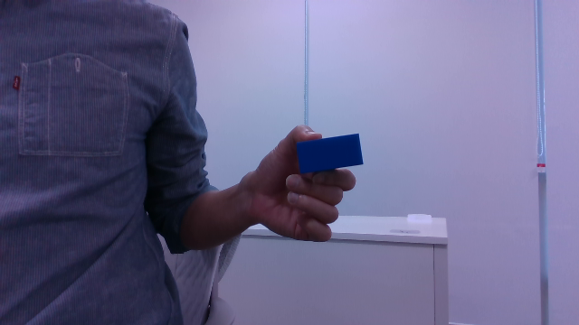
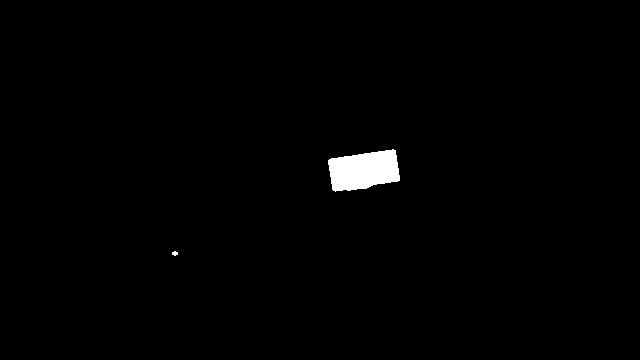
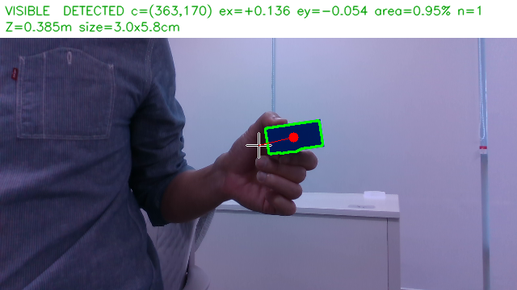
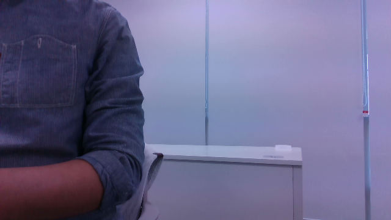
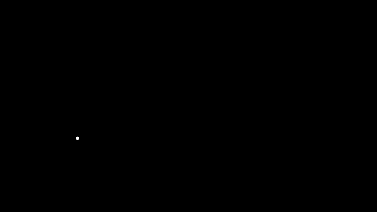
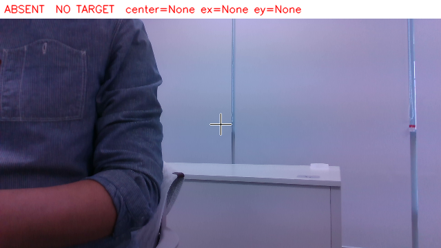
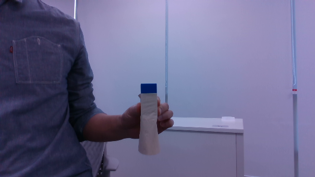
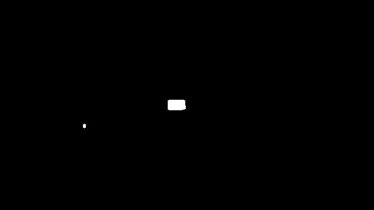
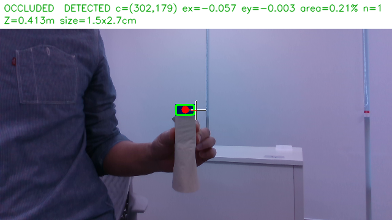

1. 배경과 구분되는 단일 색상 목표 1개를 선정
목표: 파란색 30×30×60 mm 직육면체(블루 큐브)

2. 영상 → HSV 변환 → 색상 마스크 → 잡음 제거 → 컨투어 → 대상 선택 → 중심 계산
   
| 단계          | 함수 (`detector.py`)                | 내용                                                                                       |
| ----------- | --------------------------------- | ---------------------------------------------------------------------------------------- |
| 0. 해상도 맞춤   | preprocess()                      | 처리 해상도 640×360. 비율이 다른 입력(640×480 사진)은 늘리지 않고 가운데를 16:9로 잘라 쓴다. 원본 좌표 복원 정보 Geometry 반환. |
| 1. HSV 변환   | color_mask()                      | 가우시안 블러 → cv2.cvtColor(BGR2HSV)                                                          |
| 2. 색상 마스크   | in_ranges()                       | cv2.inRange(H 104~120, S 200~255, V 8~255). 색 세기(max−min) 5 미만 픽셀 제외.                    |
| 3. 잡음 제거    | color_mask()                      | 5×5 타원 커널 열림 1회(점 잡음 제거) → 닫힘 2회(구멍 메움)                                                  |
| 4. 컨투어      | detect()                          | cv2.findContours(RETR_EXTERNAL) 외곽 컨투어                                                   |
| 5. 후보 판정    | evaluate()                        | 면적 → 모양(장변/단변·채움비·solidity) → 뎁스 거리 범위·실제 크기                                             |
| 6. 대상 선택    | select()                          | 면적이 가장 큰 것. 면적 차이가 tie_ratio(10%)                                                        |
| 7. 중심 계산    | evaluate()                        | 모멘트 중심 `m10/m00, m01/m00` (`m00 = 0`이면 `zero_moment`로 탈락)                                |
| 8. 원본 좌표·오차 | to_original(), normalized_error() | 처리 좌표 → 실제 프레임 좌표, ex·ey, 면적비                                                            |

2. HSV 범위·최소 면적·해상도를 설정 파일로 분리하고 여러 후보 중 선택 규칙
   면적·모양·뎁스 검사를 모두 통과한 후보만 남긴다.
   남은 후보 중 면적이 가장 큰 것, 면적 차이가 tie_ratio(10%) 이내인 후보끼리는 영상 중심에 더 가까운 것.

| 구분      | 키                                                                         | 값                                                                                 |
| ------- | ------------------------------------------------------------------------- | --------------------------------------------------------------------------------- |
| HSV 범위  | target.hsv_ranges                                                         | lower `[104, 200, 8]`, upper `[120, 255, 255]` (빨강처럼 0/179를 넘는 색은 범위를 2개 적으면 합집합) |
| 색 세기 하한 | target.min_chroma                                                         | 5                                                                                 |
| 해상도     | processing.width/height                                                   | 640 × 360 (D435 컬러·뎁스 모두 지원)                                                      |
| 잡음 제거   | processing.blur_ksize / morph_kernel / open_iterations / close_iterations | 5 / 5 / 1 / 2                                                                     |
| 최소 면적   | selection.min_area                                                        | auto = 0.3 × (1 m에서 30×30 mm 면의 화면 넓이). fx 454.1 → 55 px (뎁스 없을 때)                |
| depth   | depth.min_area_px                                                         | 80 px (뎁스 있을 때. 실측 1 m 최소 211 px)                                                 |
| depth   | depth.no_depth_min_area                                                   | 800 px (너무 가까워 뎁스가 0일 때 색만으로 믿을 최소 면적)                                            |
| 최대 면적   | selection.max_area_ratio                                                  | auto → 0.6 (화면의 60% 초과는 배경)                                                       |
| 모양      | selection.max_aspect / min_extent / min_solidity                          | 3.0 / 0.35 / 0.5                                                                  |
| 거리·크기   | depth.min_m / max_m, max_short_m / max_long_m, area_m2                    | 0.1~1.1 m, 짧은 변 ≤ 5 cm, 긴 변 ≤ 8 cm, 3~30 cm²                                      |
| 카메라     | camera.exposure / white_balance / options                                 | 노출 자동, 화이트밸런스 4600 K 고정, auto_exposure_priority: 1                                |

4. 원본 위에 컨투어·목표 중심·영상 중심을 표시
   detect()는 상태를 저장하지 않고 매 프레임 독립적으로 판단.
   통과 후보가 없으면 Detection(detected=False)를 반환하고 중심·오차·면적비·bbox를 모두 None으로 둔다.

| 표시           | 의미                                                                       |
| ------------ | ------------------------------------------------------------------------ |
| 초록 굵은 선      | 선택된 목표의 컨투어                                                              |
| 노랑 / 회색 가는 선 | 통과했지만 선택되지 않은 후보 / 탈락 후보                                                 |
| 빨간 점         | 목표 중심 (빨간 선 = 영상 중심에서 목표 중심까지)                                           |
| 흰 십자         | 영상 중심 (W/2, H/2)                                                         |
| 윗줄           | DETECTED c=(원본 좌표) ex ey area n 또는 NO TARGET center=None ex=None ey=None |
| 둘째 줄         | 뎁스 Z=…m size=…cm (실제 거리·크기 추정)                                           |
   

5. 목표가 잘 보이는 장면·없는 장면·일부 가려진 장면을 같은 설정으로 확인
   같은 설정 파일(config_used.yaml)로 처리. 가림 장면은 보이는 부분(1.5 × 2.7 cm)만으로 검출했고, 면적 하한을 느슨하게 설정. 마스크의 작은 점은 too_small로 탈락. 같은 원본·뎁스를 최종 설정으로 다시 처리해 캡쳐이미지를 만들었다.
   
| 장면    | 원본                                         | 마스크                                    | 검출                                        |
| ----- | ------------------------------------------ | -------------------------------------- | ----------------------------------------- |
| 잘 보임  |   |   |   |
| 없음    |    |    |    |
| 일부 가림 |  |  |  |

HSV 범위를 정한 근거

S 하한을 바꿔 가며 전체 데이터로 평가하면, 170~230에서만 인식 100%·오검출 0%. → 가운데 200.
H는 96~130 어디서나 통과 → 큐브 H 112를 가운데로 104~120.
V 하한은 8~38 모두 통과 → 이번 데이터보다 더 어두운 환경을 위해 8(더 낮은 밝기는 색 세기 하한 5로 잡음을 거른다).
처음 범위(`[103,208,26]~[116,…]`)는 큐브 앞면 8×12 px만 보고 정한 값이었다. 이후 조명별로 측정한 값으로 적용.

|     | 큐브 (p2 ~ p98)               | 배경 중 H 100~125 픽셀         |
| --- | --------------------------- | ------------------------- |
| H   | 110 ~ 113                   | 넓게 분포 (배경 전체 중앙값 122~128) |
| S   | 248 ~ 255                   | 중앙값 69~83, 상위 1% 124~163  |
| V   | 38~46 (어두움), 84~103 (보통·밝음) | 중앙값 120~138               |

배경 오검출을 줄인 조건

| 조건            | 설정                                    | 효과(근거)                                                                                                     |
| ------------- | ------------------------------------- | ---------------------------------------------------------------------------------------------------------- |
| 채도 하한 S ≥ 200 | hsv_ranges                            | 배경의 옅은 파랑(의자·카펫·데님) 제외. 배경 파란 계열의 99%가 S < 163                                                             |
| 완화 범위 제거      | relaxed_ranges 없음                     | 이전에는 "진한 파랑과 붙은 S ≥ 80 픽셀"도 인정했는데, 의자·카펫(S 80~125)이 큐브에 붙어 덩어리가 커졌다. 제거 후 뎁스 없이 판단해도 큐브 없는 장면 오검출 75% → 0% |
| 색 세기 하한       | min_chroma: 5                         | 어두운 픽셀은 잡음만으로 S가 커지므로 max−min이 작은 픽셀 제외                                                                    |
| 열림·닫힘         | 5×5, 1회·2회                            | 점 잡음 제거, 큐브 내부 구멍 메움                                                                                       |
| 최소·최대 면적      | 55 px(뎁스 없음)·80 px(뎁스), 화면 60%        | 작은 조각·화면 전체 배경 제외                                                                                          |
| 모양            | 장변/단변 ≤ 3, 채움비 ≥ 0.35, solidity ≥ 0.5 | 줄무늬·막대·구불구불한 덩어리 제외(뎁스 유무와 상관없이 항상 적용)                                                                     |
| 뎁스 거리         | 0.1~1.1 m                             | 뒤쪽 멀리 있는 같은 색 물체 제외                                                                                        |
| 뎁스 실제 크기      | 짧은 변 ≤ 5 cm, 긴 변 ≤ 8 cm, 3~30 cm²     | 같은 색이지만 크기가 다른 물체(카드·셔츠) 제외. 실측 큐브: 2.0~3.1 × 5.4~6.2 cm, 10.7~17.8 cm²                                    |

미검출 전달 방식

| 위치                             | 미검출 표현                                                                                   |
| ------------------------------ | ---------------------------------------------------------------------------------------- |
| detect() 반환                    | detected=False, center·center_original·error·area_ratio·bbox = None                      |
| 기록 JSON                        | 위 값이 `null` (scene_1_absent.json)                                                        |
| 화면                             | NO TARGET center=None ex=None ey=None, 목표 중심(빨간 점)을 그리지 않음                               |
| ROS /target (detector_node.py) | 정상 영상의 미검출은 point.z = 0(x·y = 0)으로 매 영상마다 발행. 받는 쪽은 z = 0이면 x·y로 제어하지 않는다                |
| 카메라 정지                         | 새 영상이 0.3 s 없으면 /target을 발행하지 않고 /perception_status = CAMERA_STALL — 미검출(z=0)과 통신 중단을 구분 |

조명·거리 변화에 따른 검출률·처리 속도

같은 데이터(조건당 100장)를 최종 설정과 최적화 전 설정으로 처리했다.
처리 시간 = 해상도 맞춤 ~ 중심 계산(색·모양·뎁스 검증 포함), 화면 표시·카메라 대기 제외. 

조명 변화 (거리 약 0.5 m 고정)

| 조명  | 최종: 검출률 | 최종: 처리 ms (평균/p95) | 최적화 전: 검출률 | 최적화 전: 처리 ms |
| --- | ------- | ------------------ | ---------- | ------------ |
| 어두움 | 100%    | 1.03 / 1.26        | 0%         | 7.58 / 9.36  |
| 보통  | 100%    | 0.96 / 1.15        | 100%       | 6.07 / 6.62  |
| 밝음  | 100%    | 0.97 / 1.12        | 100%       | 2.84 / 3.03  |

거리 변화 (보통 조명, 1.0 m는 어두움·밝음)

| 거리(실측 Z)           | 최종: 검출률 | 최종: 처리 ms   | 최적화 전: 검출률 | 최적화 전: 처리 ms |
| ------------------ | ------- | ----------- | ---------- | ------------ |
| 0.1 m (0.16 m)     | 100%    | 1.03 / 1.18 | 100%       | 3.19 / 3.36  |
| 0.2 m (0.32 m)     | 100%    | 1.03 / 1.17 | 100%       | 6.05 / 6.52  |
| 0.5 m (0.55 m)     | 100%    | 0.96 / 1.15 | 100%       | 6.07 / 6.62  |
| 1.0 m 어두움 (1.02 m) | 100%    | 1.28 / 1.46 | 0%         | 7.04 / 8.82  |
| 1.0 m 밝음 (1.02 m)  | 100%    | 0.96 / 1.11 | 3%         | 5.42 / 5.90  |

평균 처리 5.3 → 1.0 ms.
어두울수록 검출률이 떨어졌다(0%). 어두운 배경의 옅은 파랑이 완화 범위로 큐브에 붙어 실제 크기가 12~77 cm로 계산돼 size_mismatch로 탈락했다. 밝음 0.2 m·1.0 m도 같은 이유(짧은 변 5.2~6.0 cm).
처리 시간도 덩어리가 클수록 늘었다(뎁스 분할 시도 포함 최대 9.4 ms). 최종 설정은 마스크가 큐브만 남아 조건과 상관없이 약 1 ms로 일정하다.
거리에 따른 차이는 작다: 1 m에서도 큐브는 최소 211 px로 최소 면적(80 px)보다 크고, 뎁스는 0.15~1.03 m 전 구간에서 99~100% 측정됐다(실측 크기 2.0~3.1 × 5.4~6.2 cm).
실시간 처리 속도의 한계는 검출이 아니라 카메라: tuning bench(어두움 1.0 m, 실제 카메라, 100프레임) 프레임 대기 26.4 ms( 30 fps) 대비 검출 처리 1 ms.