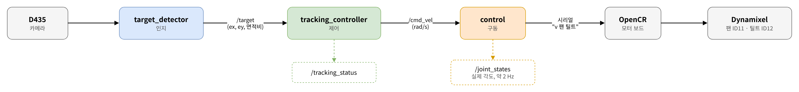
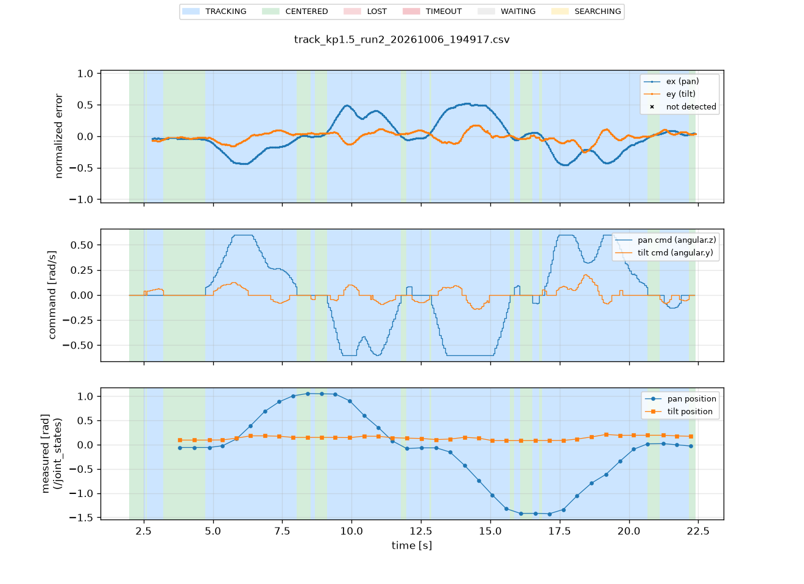
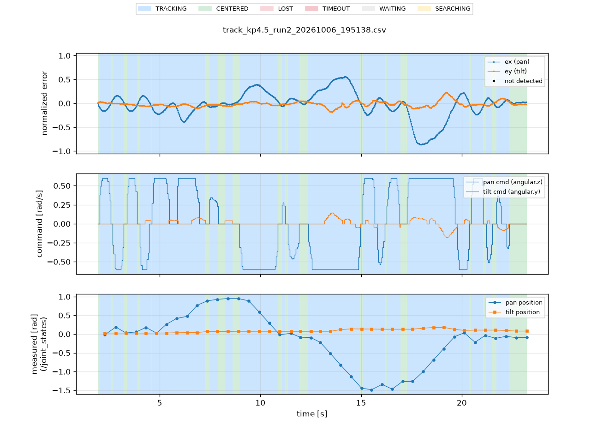

# 문제 3 — 중심 기반 추적 제어

실험 장비: 
- Raspberry Pi (Ubuntu 26.04, ROS 2 Lyrical)
- RealSense D435 + OpenCR(V3 펌웨어)
- Dynamixel 팬(ID11)·틸트(ID12)


## 1. 구성



*문제 3 구성 · 인지 → 제어 → 구동*

| 단계 | 노드 | 역할 |
|---|---|---|
| 인지 | `target_detector` | HSV·컨투어·뎁스 검증으로 퍽 검출, 화면 중심 오차 ex·ey ∈ [-1, 1] 발행 (약 30 Hz) |
| 제어 | `tracking_controller` | 오차 → 팬·틸트 각속도 명령, 상태(WAITING·TRACKING·CENTERED·LOST·TIMEOUT) 발행 (20 Hz) |
| 구동 | `control` | `/cmd_vel` → OpenCR 속도 명령, 펌웨어 상태 → `/joint_states` |

실행 (보드):

```bash
ros2 run xmen_control control --ros-args -p port:=/dev/ttyACM0   # 구동, 시작 시 홈 복귀
ros2 launch target_bringup bringup.launch.py                       # detector + controller (+ motor_driver 출력 OFF, 로그만)
```

| 패키지 (보드 경로) | 실행 파일 | 설정 |
|---|---|---|
| `xmen_vision/target_perception` | `detector` — pyrealsense2로 카메라 직접(`source:=realsense`), 640×360@30 | `config/detector.yaml` |
| `xmen_control/target_control` | `controller`, `motor_driver` | `xmen_bringup/target_bringup/config/tracking.yaml` |
| `xmen_control` (제어 담당) | `control` — V3 펌웨어 `v <팬> <틸트>` [rad/s] | 파라미터 `port`, `auto_home` |

## 2. 방향·부호 확인

추적을 끄고(controller 미실행) control만 켠 상태에서 작은 명령(0.1 rad/s)을 축마다 보내 실제 회전 방향을 확인했다.


```bash
ros2 topic pub -r 20 /cmd_vel geometry_msgs/msg/Twist "{angular: {z: 0.1}}"   # 팬
ros2 topic pub -r 20 /cmd_vel geometry_msgs/msg/Twist "{angular: {y: 0.1}}"   # 틸트
```

| 축 | `/cmd_vel` + 명령 시 실제 방향 | 오차 정의 | 결정한 direction |
|---|---|---|---|
| 팬 (angular.z) | 왼쪽 | ex > 0 = 목표가 오른쪽 → 오른쪽(음수)으로 회전 | `cmd_sign = -1` |
| 틸트 (angular.y) | 위 | ey > 0 = 목표가 아래 → 아래(음수)로 회전 | `cmd_sign_tilt = -1` |

control은 `/cmd_vel`을 부호 변환 없이 펌웨어로 전달한다(`pan, tilt = angular.z, angular.y`). 부호는 controller의 `cmd_sign`·`cmd_sign_tilt` 한 곳에서만 정한다.

부호 결정 기준: 목표를 오른쪽·아래에 두었을 때 카메라가 그쪽으로 돌아 오차가 줄어드는지로 판단했다.
첫 시험(`cmd_sign_tilt = 1`)에서는 목표가 화면 아래(ey ≈ +0.9)에 있을 때 틸트 명령이 +0.4(위)로 나가 목표가 화면 아래로 빠졌고, LOST↔TRACKING이 반복됐다. `cmd_sign_tilt = -1`로 바꾼 뒤 해소됐다.
시험 중 control.py에 틸트 반전(`-angular.y`)이 임시로 들어가 부호가 두 번 뒤집힌 적이 있어, 반전은 제거하고 controller 한 곳에서만 부호를 정하기로 했다.

## 3. 제어식과 설정

속도형 P 제어 (축마다 독립):

```
command = 0                                                  (|e| < deadband)
command = clamp(direction × Kp × e, -speed_limit, +speed_limit)   (그 외)
```

| 항목 | 팬 | 틸트 | 단위·비고 |
|---|---|---|---|
| Kp | 1.5 / 2.0 / 2.5 / 4.5 (비교 대상) | 0.8 (고정) | [rad/s] per 정규화 오차 1.0. ex = 1 ≈ 화각 절반(팬 약 35°, 틸트 약 21°) |
| direction | -1 | -1 | 2절 |
| speed_limit | 0.6 | 0.4 | rad/s |
| deadband | 0.05 | 0.05 | 정규화 오차 |
| 명령 주기 | 20 Hz 타이머 | | 각속도 명령이라 controller에서 적분하지 않음(dt 사용 없음). 위치 변화는 펌웨어·모터 프로파일이 만든다 |
| 입력 타임아웃 | 0.5 s | | 신선한 `/target`이 없으면 TIMEOUT, 정지 명령. 촬영 시각이 0.5 s보다 오래된 입력도 거부 |
| 미검출 | z = 0 → LOST, 정지 명령 | | 이전 속도 유지 안 함 |

회전 범위·정지 (펌웨어, 제어 담당):
- 범위: 팬 ±180°, 틸트 ±135° (홈 기준). 범위 끝에서 감속 후 위치 유지. 바깥 방향 명령 차단 여부 (확인 필요)
- 속도 명령이 500 ms 동안 갱신되지 않으면 펌웨어가 스스로 정지, control은 0.5 s 무명령 시 `v 0 0` 전송
- 속도 명령은 "범위 끝을 목표로 한 프로파일 속도 이동"으로 구현되어 있고 가속 시간 0.3 s


- kp1.5 

<br>


- kp2.0 

<br>


- kp2.5 

<br>


## 4. 시험 방법

- 시나리오: 왼쪽 3초 정지 → 중앙 3초 → 오른쪽 3초 → 중앙 3초. 바닥에 위치 표시를 붙여 반복 조건을 맞췄다.
- 회차 시작 전 원점 복귀: `ros2 topic pub --once /opencr/home std_msgs/msg/Empty '{}'`
- Kp 4종 × 3회, 회차마다 rosbag 기록: `/target /cmd_vel /tracking_status /joint_states /perception_status`
- 분석(PC): bag 재생 → `track_logger`로 CSV 변환 → `track_plot`으로 요약. 파라미터 값은 보드 `tracking.yaml`에서 kp만 바꿔 bringup을 재시작했다(나머지 고정)
- 실제 Kp는 CSV의 명령/오차 비로 역산해 12회 모두 설정값과 일치함을 확인했다.
- 수평 RMSE = sqrt(mean(ex²)), 검출되고 상태가 TRACKING·CENTERED인 프레임만 사용. CENTERED는 오차가 데드밴드 안이라 명령이 0인 추적 상태이므로 추적 구간에 포함했다. 사용·제외 프레임 수를 함께 적는다.
- 포화 비율 = |ex| > 0.06(데드밴드 밖)일 때의 명령 중 |명령| ≥ 0.59 rad/s(상한 0.6)인 비율.

달라진 조건:
- run1은 다른 세션에서 먼저 기록했다(bag 녹화 시각: kp4.5 18:19, kp2.5 18:28, kp1.5 19:20, kp2.0 19:26 / run2·3은 모두 19:39~19:46). 기록 길이도 31~42 s로 run2·3(18~24 s)보다 길고, 포화 비율이 3~10%(kp4.5 제외)로 낮다. 퍽을 더 천천히 옮기는 등 조건이 달랐던 것으로 보여 같은 조건 비교(5절 run2·3 열, 6절)에서 제외하고 참고값으로만 둔다.
- 그 결과 같은 조건 회차는 Kp마다 2회다. 발제의 "Kp별 3회"는 run1을 포함해야 채워지므로, 3회 값은 조건 차이를 밝힌 참고값으로 함께 적는다. 단, 흔들림 지표(5절)는 run1을 넣어도 빼도 결론이 같다.
- kp2.0_run2는 검출 비율 76.8%로 135프레임이 제외됐다. (원인 확인 필요)
- 조명·거리·목표 이동 담당자 (확인 필요)

## 5. 결과

### 회차별

| 회차 | 길이 [s] | 처리 FPS | 검출 출력 비율 | 사용 / 제외 | RMSE ex | RMSE ey | 최대 \|ex\| | 포화 비율 |
|---|---|---|---|---|---|---|---|---|
| kp1.5_run1 | 35.4 | 29.9 | 0.882 | 907 / 152 | 0.202 | 0.097 | 0.966 | 0.03 |
| kp1.5_run2 | 19.6 | 29.6 | 1.000 | 581 / 0 | 0.264 | 0.077 | 0.522 | 0.32 |
| kp1.5_run3 | 18.5 | 30.0 | 0.998 | 552 / 2 | 0.317 | 0.079 | 0.623 | 0.37 |
| kp2.0_run1 | 31.3 | 30.0 | 0.989 | 927 / 13 | 0.172 | 0.088 | 0.540 | 0.10 |
| kp2.0_run2 | 18.2 | 30.0 | 0.768 | 412 / 135 | 0.395 | 0.085 | 0.842 | 0.62 |
| kp2.0_run3 | 20.5 | 30.0 | 0.998 | 611 / 4 | 0.295 | 0.076 | 0.948 | 0.41 |
| kp2.5_run1 | 42.1 | 30.0 | 1.000 | 1261 / 1 | 0.116 | 0.101 | 0.326 | 0.09 |
| kp2.5_run2 | 21.3 | 30.0 | 1.000 | 639 / 0 | 0.332 | 0.068 | 0.882 | 0.51 |
| kp2.5_run3 | 18.1 | 30.0 | 1.000 | 541 / 1 | 0.353 | 0.075 | 0.785 | 0.69 |
| kp4.5_run1 | 42.5 | 30.0 | 0.471 | 590 / 684 | 0.124 | 0.149 | 0.475 | 0.44 |
| kp4.5_run2 | 21.3 | 30.0 | 1.000 | 639 / 0 | 0.280 | 0.058 | 0.861 | 0.67 |
| kp4.5_run3 | 23.9 | 30.0 | 1.000 | 715 / 2 | 0.350 | 0.056 | 0.913 | 0.75 |

검출 출력 비율은 `/target`의 z > 0 비율이다(목표가 항상 화면 안에 있다는 가정). 사람이 영상과 대조하는 문제 4의 검출률과는 다르다. 처리 FPS는 `/target` 수 / 경과 시간이며 카메라 설정은 30 fps.

### Kp별 평균

같은 조건(run2·3) 기준. 3회 평균 열은 조건이 다른 run1을 포함한 참고값이다.

| Kp | run2·3 RMSE ex (각 회차) | run2·3 평균 | run2·3 검출 출력 비율 | run2·3 포화 비율 | 참고: run1 포함 3회 평균 ± 표준편차 |
|---|---|---|---|---|---|
| 1.5 | 0.264, 0.317 | 0.291 | 0.999 | 0.35 | 0.261 ± 0.058 |
| 2.0 | 0.395, 0.295 | 0.345 | 0.883 | 0.51 | 0.288 ± 0.112 |
| 2.5 | 0.332, 0.353 | 0.342 | 1.000 | 0.60 | 0.267 ± 0.131 |
| 4.5 | 0.280, 0.350 | 0.315 | 1.000 | 0.71 | 0.252 ± 0.116 |

그래프: Kp별 대표 회차(run2)의 시간–ex·ey, 시간–명령, 시간–실제 각도(`/joint_states`). 배경색은 상태 구간. 
명령과 실제 각도는 서로 다른 그래프에 그린다. 실제 각도는 약 2 Hz로만 측정되어 점으로 표시한다.

### 흔들림 (진동) 비교

같은 CSV에서 흔들림을 따로 계산했다.
- 부호 반전 = 검출 프레임의 ex가 데드밴드(±0.05) 밖에서 부호를 바꾼 횟수 / 10 s. 0.05 이내 프레임은 건너뛴다. 팬 명령의 부호 반전 횟수와 12회 모두 같았다.
- 중심 근처 RMS = |ex| < 0.3 프레임만으로 계산한 sqrt(mean(ex²)). 이동 직후의 포화 구간을 뺀 값이다.

| Kp | 부호 반전 / 10 s (run1, run2, run3) | 3회 평균 | run2·3 평균 | 중심 근처 RMS (run1, run2, run3) |
|---|---|---|---|---|
| 1.5 | 2.3, 3.6, 2.7 | 2.9 | 3.1 | 0.161, 0.132, 0.146 |
| 2.0 | 1.9, 2.4, 2.4 | 2.3 | 2.4 | 0.142, 0.111, 0.132 |
| 2.5 | 1.9, 3.3, 2.8 | 2.7 | 3.0 | 0.113, 0.125, 0.110 |
| 4.5 | 4.3, 7.0, 6.7 | 6.0 | 6.9 | 0.096, 0.128, 0.118 |

시나리오상 목표가 중심을 지나는 이동이 있어 Kp와 상관없이 일정 횟수의 반전은 생긴다. Kp 간 비교는 이 기본값보다 얼마나 많은지로 본다.



*Kp 1.5 run2 — 위: ex·ey, 가운데: 팬·틸트 명령, 아래: `/joint_states` 실제 각도(약 2 Hz). 이동 구간에서만 0.6 rad/s 포화, 중심 근처에서는 반전이 작다*



*Kp 4.5 run2 — 같은 구성. 2~5 s, 15~17 s, 20~22 s에 ex가 ±0.15~0.2로 중심을 오가고 팬 명령이 +0.6 ↔ −0.6으로 번갈아 나간다(부호 반전 7.0회 / 10 s)*

## 6. 해석

1. 같은 조건(run2·3)에서 Kp별 평균 RMSE ex는 0.291~0.345로 차이가 약 0.05인데, 같은 Kp 안의 회차 간 차이는 최대 0.10(Kp 2.0: 0.295 vs 0.395)으로 더 크다. 이 범위의 Kp로는 성능 차이를 구분할 수 없다.
2. 원인은 속도 포화다. Kp = 1.5에서도 |ex| ≥ 0.4면 명령이 0.6 rad/s에 걸린다. 시나리오가 목표를 ±0.5 이상 한 번에 옮기므로 이동 직후에는 Kp와 관계없이 최대 속도로 회전하고, 오차 감소 속도는 speed_limit이 결정한다. Kp가 커질수록 포화 비율이 0.35 → 0.71로 늘었다.
3. (조건이 다른 run1, 참고) Kp = 4.5_run1은 검출 출력 비율 47%, 제외 684프레임으로, 중심을 지나쳐 목표를 화면 밖으로 놓친 구간이 길었다. RMSE(0.124)가 낮게 나온 것은 놓친 프레임이 계산에서 빠졌기 때문이므로 좋은 결과로 해석하지 않는다.
4. Kp = 1.5는 run2·3 기준 포화 비율과 최대 |ex|가 가장 낮고 검출이 안정적이었다. 흔들림(부호 반전)은 1.5~2.5 사이에서 차이가 없어(run2·3 평균 2.4~3.1회) 선택 근거로 쓰지 않았다. 현재 speed_limit 0.6 rad/s에서는 Kp 1.5~2.5 범위가 적절하고, 4.5는 놓침 위험이 있다.
5. 응답 지연 요인: 카메라 → 검출 → controller(20 Hz) → control(최대 20 Hz 전송) → 펌웨어(가속 0.3 s). 정지 시에는 데드밴드 경계(|ex| ≈ 0.05 → 0.05 × 35° ≈ 1.8°)에서 멈춘다.
6. RMSE와 달리 흔들림은 Kp에 따라 갈린다. 같은 조건(run2·3)에서 Kp = 4.5의 부호 반전은 10 s당 6.7~7.0회로, 다른 Kp(2.4~3.6회)의 약 2배다. 조건이 다른 run1을 넣어도 4.5(4.3회)가 다른 Kp의 최댓값(3.6회)보다 많아 결론은 같다. 그래프에서도 4.5는 중심 근처에서 ±0.6 rad/s 명령이 좌우로 번갈아 나가는 진동이 보인다. 중심 근처 RMS는 0.10~0.16으로 Kp마다 뚜렷한 차이가 없어(4.5 run1의 0.096이 가장 낮지만 run2·3은 0.118~0.128), Kp를 올려도 중심 오차는 줄지 않고 흔들림만 늘었다.
