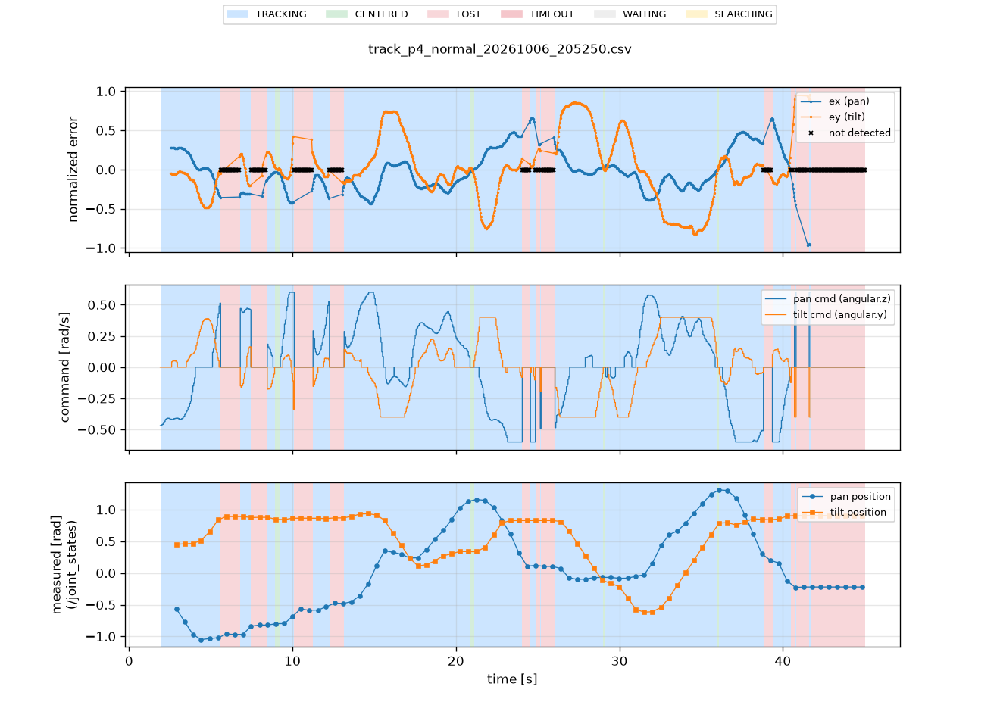
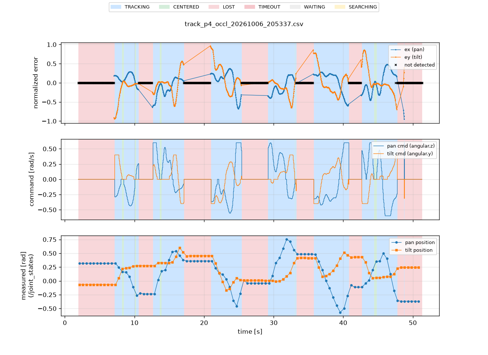
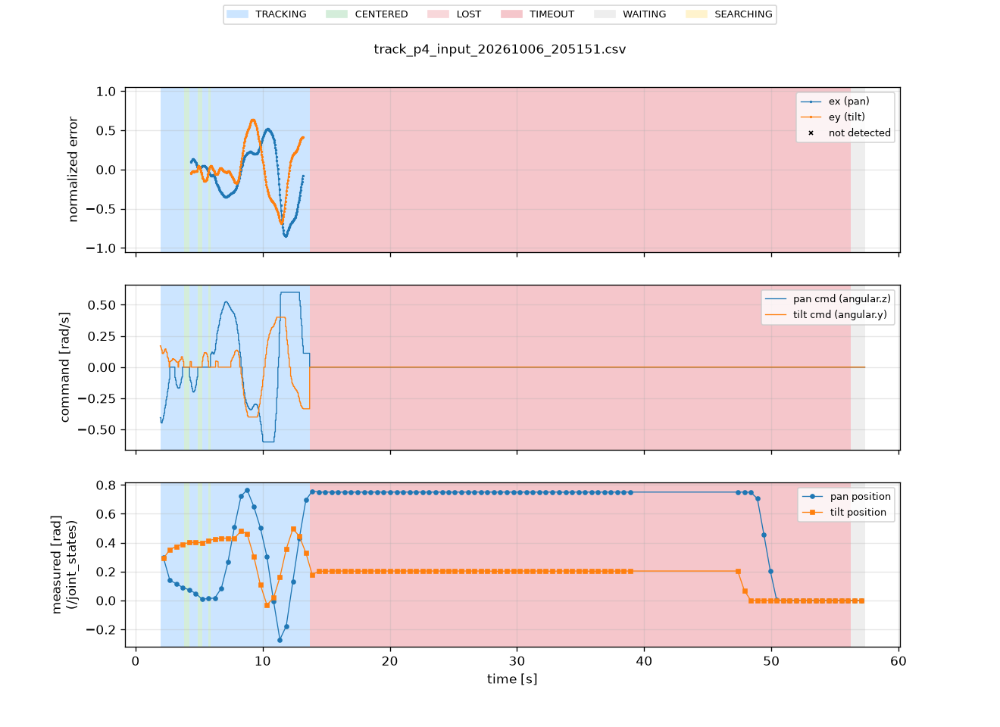
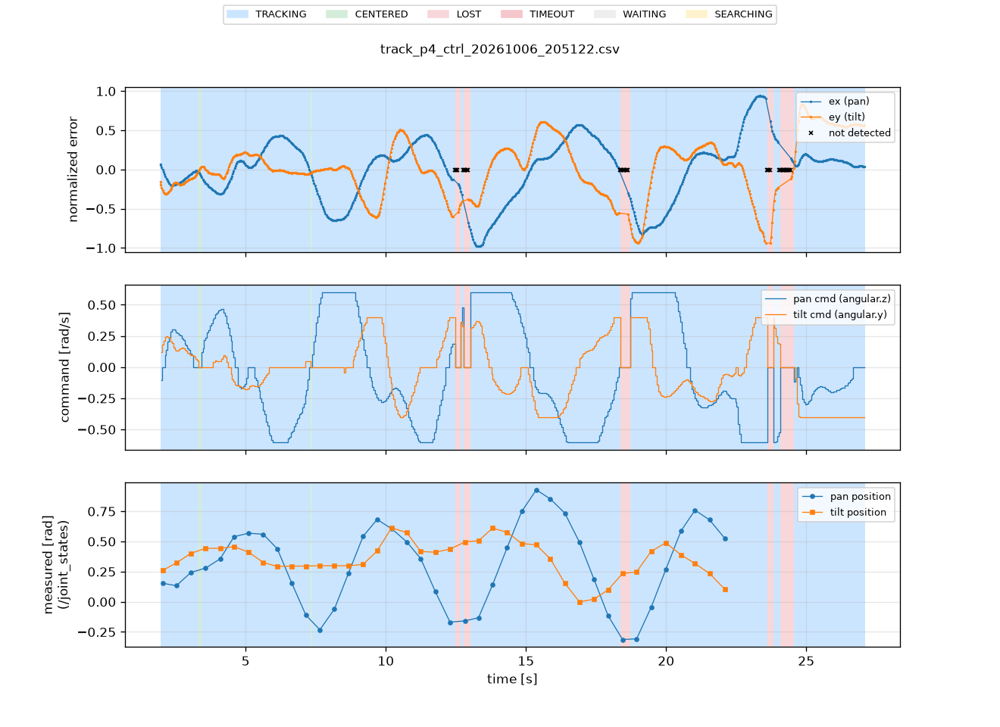
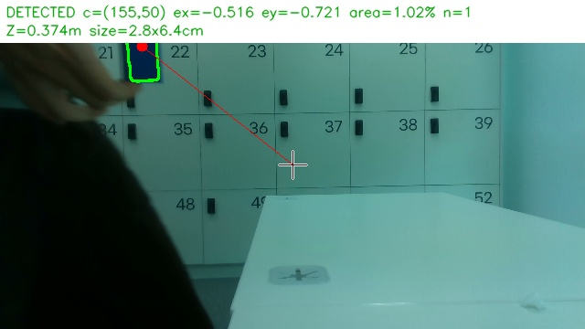
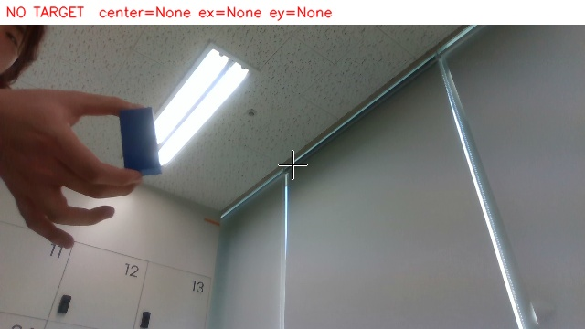
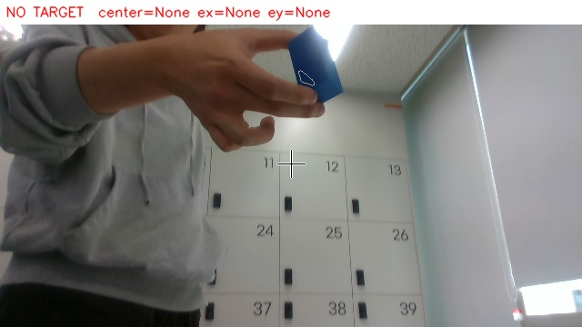
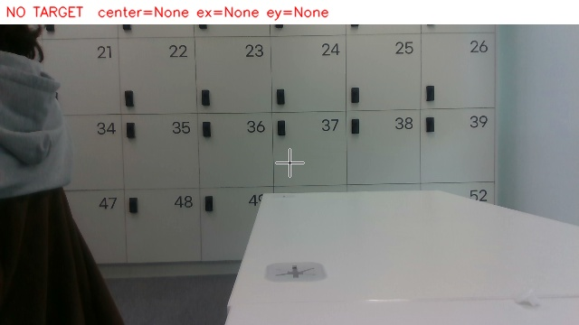

# 문제 4 — 성능 측정과 소실 복구

## 1. 상태와 동작

| 발제 상태 | 구현 상태 (`/tracking_status`) | 조건 | 동작 |
|---|---|---|---|
| IDLE | `WAITING` | 시작 후 신선한 입력을 아직 받지 못함 | 정지 명령 |
| IDLE | `IDLE` | `/tracking_enable` = false (명시적 중지) | 정지 명령. true가 되면 복귀 절차부터 |
| TRACKING | `TRACKING` / `CENTERED` | 신선한 입력에서 검출(z > 0). CENTERED는 두 축 모두 데드밴드 안 | 속도 상한·데드밴드 안에서 P 제어 / 정지 |
| LOST | `LOST` | 신선한 입력에서 미검출(z = 0) | **미검출 첫 프레임부터** 정지 명령. 이전 속도·좌표 사용 안 함 (표시 유예 없음) |
| LOST | `TIMEOUT` | 마지막 신선한 입력 후 0.5 s 경과, 또는 촬영 시각이 0.5 s보다 오래됨 | 정지 명령 |
| 복귀 | `LOST` → `TRACKING` | 신선한 입력에서 **연속 3프레임** 검출(`recover_frames: 3`, 30 fps ≈ 0.1 s). 중간에 미검출이 끼면 처음부터 셈 | 그동안 LOST 유지·정지, 3프레임 뒤 같은 P 제어(속도 상한 적용)로 재개 |

정지 보장 (구동 쪽, 제어 담당):
- control: `/cmd_vel`이 0.5 s 동안 없으면 `v 0 0` 전송
- OpenCR V3 펌웨어: 속도 명령이 500 ms 동안 갱신되지 않으면 스스로 정지 (control 프로세스가 죽어도 동작)
- 속도 명령은 위치 목표로 구현되어 있으나, 정지는 "목표 갱신 중단"이 아니라 펌웨어가 현재 위치를 목표로 다시 쓰는 방식이다. 실제 정지는 3.4절 제어 통신 중단 시험으로 확인한다.

시야 밖 탐색은 하지 않았다. 기본 복구 = 시야 안 재등장 재검출.

설정: Kp = 1.5 (문제 3에서 RMSE·포화 비율이 가장 낮았던 값), Kp_tilt 0.8, 속도 상한 0.6 / 0.4 rad/s, 데드밴드 0.05, 명령 20 Hz, 입력 타임아웃 0.5 s.

## 2. 시험 방법

| 시험 | bag | 방법 |
|---|---|---|
| 정상 추적 | `p4_normal` | 30 s 이상 퍽을 움직이며 추적 |
| 가림 후 재등장 | `p4_occl` | 추적 중 손으로 약 2 s 가렸다가 치우기 5회 |
| 인지 입력 중단 | `p4_input` | 추적 중 `pkill -f target_perception/detector` |
| 제어 통신 중단 | `p4_ctrl` | 모터가 회전하는 중 `pkill -9 -f xmen_control/control`, 모터 정지를 영상으로 확인 |

기록 토픽: `/target /cmd_vel /tracking_status /joint_states /perception_status`.
분석(PC): bag 재생 → `track_logger` CSV → `track_recovery`(이벤트·복구 시간) · `track_plot`(FPS·RMSE).

이벤트 판정 (`track_recovery`):
- 소실 시각 = 상태가 TRACKING·CENTERED → LOST·TIMEOUT으로 바뀐 시각
- 정지 = 그 뒤 첫 `/cmd_vel`이 팬·틸트 모두 0
- 재등장 시각 = 그 뒤 처음 검출된 `/target`
- 복귀 시각 = 재등장 뒤 처음 TRACKING·CENTERED
- 복구 시간 = 복귀 − 재등장, 3 s 이내면 성공

## 3. 결과

### 3.1 정상 추적 (`p4_normal`, 42.5 s)

| 지표 | 값 | 비고 |
|---|---|---|
| 처리 FPS | 29.98 | `/target` 수 / 경과 시간. 카메라 설정 30 fps |
| 검출 출력 비율 | 76.4% (1274프레임 중 z > 0) | 사람 대조 검출률은 4절 |
| 수평 RMSE (ex) | 0.247 | 추적 구간 938프레임 사용, 336프레임 제외. 추적 구간 비율 73.6% (938 / 1274), 검출 프레임 중 TRACKING 96.4% (938 / 973) |
| 수직 RMSE (ey) | 0.407 | |
| 최대 \|ex\| | 0.953 | |
| 소실 | 11회, 그중 10회 복구 (0.07~0.32 s) | 마지막 1회는 녹화 종료로 판정 불가 |

*정상 추적 — 위: ex·ey(× = 미검출), 가운데: 팬·틸트 명령, 아래: `/joint_states` 실제 각도(약 2 Hz). 배경색은 상태(파랑 TRACKING, 분홍 LOST). 15 s 이후 ey가 ±0.5~0.85까지 커지고 틸트 명령이 ±0.4 rad/s 상한에 자주 걸린다*

### 3.2 가림 후 재등장 (`p4_occl`)

| 회 | 소실 [s] | 정지까지 [s] | 재등장 [s] | 가림 시간 [s] | 복귀 [s] | 복구 시간 [s] | 판정 |
|---|---|---|---|---|---|---|---|
| 1 | 10.614 | 0.050 | 12.561 | 1.95 | 12.663 | 0.102 | 성공 |
| 2 | 17.114 | 0.049 | 20.899 | 3.79 | 21.015 | 0.116 | 성공 |
| 3 | 25.417 | 0.046 | 29.135 | 3.72 | 29.215 | 0.080 | 성공 |
| 4 | 33.263 | 0.051 | 35.668 | 2.41 | 35.767 | 0.099 | 성공 |
| 5 | 40.812 | 0.051 | 42.540 | 1.73 | 42.664 | 0.124 | 성공 |

- **복구 성공률 5 / 5 = 100%**, 복구 시간 평균 0.104 s (0.080~0.124 s)
- 5회 모두 소실 후 다음 명령 주기(≤ 0.05 s) 안에 정지 명령
- 복구 시간 ≈ 연속 3프레임(0.1 s) + 명령 주기. 복귀 조건이 의도대로 동작함
- 의도하지 않은 소실 2회(47.8 s: 0.11 s 만에 복구 / 48.8 s: 녹화 종료로 재등장 미기록)는 가림 시험 통계에서 제외하고 여기 기록한다
- 2·3회차는 가림 시간이 3.7~3.8 s로 발제 조건(약 2 s)보다 길었다. 복구 판정(재등장 후 3 s 이내)에는 영향이 없다.

*가림 후 재등장 — 분홍(LOST) 구간마다 팬·틸트 명령이 0으로 떨어지고 실제 각도가 평평하게 유지된다. 시작 0~7 s의 LOST는 시험 시작 전(목표를 아직 보여주지 않음)이다*

### 3.3 인지 입력 중단 (`p4_input`)

| 마지막 입력 [s] | TIMEOUT [s] | 타임아웃까지 [s] | 정지 명령 |
|---|---|---|---|
| 13.155 | 13.696 | 0.541 | 다음 주기(0.050 s) 안에 0 |

설정 0.5 s + 명령 주기(0.05 s) 안에서 TIMEOUT으로 바뀌고 정지 명령을 냈다. 이후 controller가 재시작될 때(56.2 s, WAITING)까지 약 42.5 s 동안 /cmd_vel 594개가 모두 0이었다.

*인지 입력 중단 — 13.7 s부터 TIMEOUT(진한 분홍), 명령은 0으로 유지되고 실제 각도도 팬 0.75 rad·틸트 0.21 rad에서 멈춰 있다. 48~50 s에 각도가 0으로 움직인 것은 명령이 0인 동안이므로 `/cmd_vel`에 의한 것이 아니다*

### 3.4 제어 통신 중단 (`p4_ctrl`)

| 항목 | 값 |
|---|---|
| control 종료 시각 | 약 22.1 s (마지막 `/joint_states` 22.09 s) |
| 종료 직전 회전 | 팬 0.68 → 0.53 rad(약 −0.28 rad/s), 틸트 0.23 → 0.11 rad(약 −0.24 rad/s). 21.55~22.09 s `/joint_states` 기준으로 회전 중에 종료함 |
| 종료 후 tracker 명령 | 27.07 s까지 0이 아닌 명령이 계속 나감(틸트 −0.4 rad/s 포화). tracker는 control 종료를 알지 못하므로 정지는 펌웨어 워치독에만 의존 |
| 모터 정지 (간접) | 24.8~27.1 s에 틸트 −0.4 rad/s 포화 명령이 나가는데도 ey가 0.55~0.79에서 변하지 않음 → 카메라가 명령에 반응하지 않음 = 정지로 판단. 목표를 고정해 두었다는 가정이 필요하고, 정지 시점(500 ms 이내인지)은 bag으로 알 수 없음 |
| 재기동 후 위치 | 측정 안 함 — bag에 control 재시작 구간이 없음 |

control이 죽으면 `/joint_states`도 끊기므로 bag만으로는 정지를 증명할 수 없다. 정지 판정은 영상으로 한다.
종료 전 추적 중 짧은 소실 5회(0.07~0.12 s 만에 복구)는 이 시험의 판정 대상이 아니다.

*제어 통신 중단 — 아래 그래프의 실제 각도가 22.1 s에서 끊긴다(control 종료). 가운데 그래프에서 그 뒤에도 tracker 명령은 계속 나가고, 25 s 이후 틸트 −0.4 rad/s 포화 명령에도 위 그래프의 ey가 거의 변하지 않는다*

## 4. 검출률·배경 오검출 (사람 대조)

| 지표 | 계산 | 조건 | 결과 |
|---|---|---|---|
| 검출률 | 올바른 검출 / 목표가 보이는 장 × 100 | `frames/p4_normal2` 100장 | 검출기 출력 기준 95 / 100 = 95%. 미검출 5장은 모두 목표가 보이는데 놓친 것으로 확인. 검출 95장의 정답 대조 |
| 배경 오검출 | 목표가 없는 장 중 검출(`_1`)된 수 | `frames/p4_empty` 105장 | 검출기 출력 기준 0 / 105. 목표 없음 육안 확인 |

| 검출 | 미검출 (역광) | 미검출 (손 겹침·반사) | 목표 없음 |
|---|---|---|---|
|  |  |  |  |
| 검출, 거리 0.37 m, 크기 2.8 × 6.4 cm | 형광등 앞에서 목표가 어둡게 찍힘 | 손가락이 목표를 가로지르고 윗면에 하이라이트 | 오검출 없음 |

미검출 5장 중 3장은 카메라가 위를 향해 형광등이 배경에 들어온 역광 장면이고, 2장은 손가락이 목표를 가로지르고 반사 하이라이트가 있는 장면이다.

## 5. 해석

1. 소실 시 정지와 3프레임 복귀는 의도대로 동작했다. 가림 5회 모두 정지했고 0.08~0.12 s 만에 복귀했다(3 s 기준 대비 충분히 짧다).
2. 입력이 끊기면 0.54 s 만에 TIMEOUT·정지로 바뀌어 "이전 속도 유지"가 없다.
3. 정상 추적에서 검출 출력 비율이 76%로 낮고 소실이 11회 있었다. 소실 직전 위치는 12회 중 9회가 |ex| 0.29~0.44로 화면 안쪽이어서, 목표가 화면 밖으로 나간 것이 아니라 검출이 끊긴 것으로 보인다. 나머지 3회(24.8 s ex 0.61, 40.8 s ey 0.95, 41.7 s ex −0.95·ey 0.95)는 목표가 화면 가장자리로 나간 소실이다. 후보 원인: 카메라·목표 이동 중 모션 블러, 조명에 따른 HSV 이탈, 뎁스 검증 탈락. 
4. 수직 RMSE(0.407)가 수평(0.247)보다 크다. 15 s 이후 |ey| > 0.5인 프레임이 252 / 938개이고, 같은 구간(15~41 s) 틸트 명령의 33%가 상한 0.4 rad/s에 포화됐다. 실제 틸트 각도도 −0.62~0.91 rad로 크게 움직였다. 목표를 상하로 크게 옮겨 틸트 속도 상한에 걸린 것으로 보인다.

## 6. 프레임별 기록

발제 권장 컬럼 CSV: `~/bags/csv/track_p4_*_frames.csv`
(`run_id, time_s, frame_id(촬영 시각 ns), detected, ex, ey, area_ratio, state, command, command_tilt, command_unit`)
이벤트 표: `~/bags/csv/recovery_events.csv`

