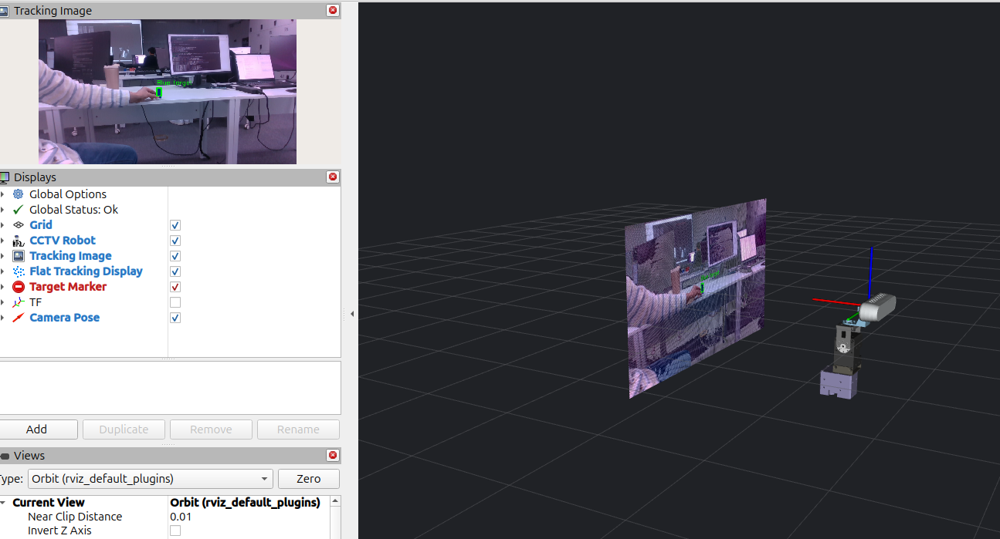

# 문제 5 — bag 재현과 팀 협업 (초안)

작성날짜: 2026-10-08

실험 장비:
- Raspberry Pi (Ubuntu 26.04, ROS 2 Lyrical)
- RealSense D435 + OpenCR(V3 펌웨어)
- Dynamixel 팬(ID11)·틸트(ID12)

재처리 PC: (확인 필요 — OS·ROS 2 버전), 기준 커밋 `74984e3` (develop, PR #14 병합)

## 1. 구현 내용

| 항목 | 내용 | 위치 |
|---|---|---|
| 기록 | 대표 성공 장면·소실/복귀 장면을 영상·뎁스·목표·명령·관절 토픽과 함께 기록 | `~/bags/p5_success`, `~/bags/p5_loss_return` |
| 메타데이터 | bag마다 `metadata.yaml` + `bag_info.txt`(해상도·토픽·메시지 수·기간) + 실행 당시 설정 3종 + `uncommitted.diff` | 각 bag 폴더 |
| 입력 재처리 | bag 영상만 재생 → `tracker_node`로 다시 검출 → `/target_replay` 등 별도 토픽으로 기록 | `~/bags/p5_*_replay` |
| 결과 재분석 | 저장된 `/target`·`/cmd_vel`에서 FPS·검출 출력 비율·RMSE·소실 이벤트 재계산, 재처리 결과와 프레임별 대조 | `replay_info.txt`, `compare.csv` |
| 다른 팀원 실행 | 다른 PC에서 `p5_success` 입력 재처리 + RViz 확인 (부분 구간) | 4절, `pic/third_party_replay_rviz.png` |
| 협업 기록 | (작성 중) | `team.md` |

## 2. 기록 (bag)

### 2.1 기록 조건

| 항목 | 값 |
|---|---|
| 해상도 | 640 × 360 (컬러·정렬 뎁스) |
| 카메라 설정 FPS | 30 |
| 저장 형식 | mcap |
| 검출 설정 | `detector.yaml` (파란 30×30×60 mm 직육면체, H 104~120 · S 200~255 · V 8~255) |
| 추적 설정 | `tracker.yaml` — `tracker_type: fusion`, Kp 1.5 (팬) / 1.2 (틸트), 데드밴드 0.05, 속도 상한 0.9 / 0.6 rad/s, 처리 15 Hz, 명령 20 Hz, 타임아웃 0.5 s |
| 구동 설정 | `control.yaml` — `control_lite`, 115200 baud, 시작 시 홈 복귀 |
| 기준 커밋 | (확인 필요 — `bag_info.txt`의 기준 커밋 칸이 비어 있음. `uncommitted.diff`는 0 byte로 작업 트리는 깨끗했음) |

두 bag의 설정 3종은 같다(`diff` 확인).

기록 명령 (보드):

```bash
ros2 bag record -s mcap -o ~/bags/p5_success \
  /camera/color/image_raw /camera/aligned_depth_to_color/image_raw /camera/color/camera_info \
  /target /cmd_vel /perception_status /joint_states
```
(확인 필요 — 실제 사용한 명령으로 교체)

### 2.2 bag 메타데이터

| bag | 장면 | 기간 [s] | 크기 | 메시지 수 | SHA-256 (mcap) |
|---|---|---|---|---|---|
| `p5_success` | 대표 성공 | 47.81 | 912.0 MiB | 4864 | `f2d9a2c3…8b7594638` |
| `p5_loss_return` | 소실·복귀 | 29.48 | 575.0 MiB | 3101 | `34fc72b6…1e63938` |

<details><summary>SHA-256 전체</summary>

```
f2d9a2c33547641fc7f84f8fb68dab871acf54decc5ad8fee0d890e072835fdb  p5_success/0_p5_success_2026_10_08-10_13_52.mcap
34fc72b612c7951e1482b66602929717cd66bacc1768d0ef6c9fc4c8b7594638  p5_loss_return/0_p5_loss_return_2026_10_08-10_24_02.mcap
4e73e3c181ef73643a27947f4c27bcf80aef67b797c31f2d99673df3a8744ffc  p5_success_replay/0_p5_success_replay_2026_10_08-11_56_18.mcap
481a5b2b612f663c9b8f0e337e6ce3368b89c8b27f5075fc82806bb4f1e63938  p5_loss_return_replay/0_p5_loss_return_replay_2026_10_08-11_58_16.mcap
```
</details>

| 토픽 | 타입 | `p5_success` | `p5_loss_return` |
|---|---|---|---|
| `/camera/color/image_raw` | sensor_msgs/Image | 594 | 374 |
| `/camera/aligned_depth_to_color/image_raw` | sensor_msgs/Image | 591 | 373 |
| `/camera/color/camera_info` | sensor_msgs/CameraInfo | 592 | 374 |
| `/target` | geometry_msgs/PointStamped | 353 | 247 |
| `/cmd_vel` | geometry_msgs/Twist | 418 | 326 |
| `/perception_status` | std_msgs/String | 42 | 54 |
| `/joint_states` | sensor_msgs/JointState | 2274 | 1353 |

접근 위치: (확인 필요 — 용량이 커서 GitHub에 올리지 않음. 외부 저장소 링크·권한)

## 3. 재현

두 재현 모두 **모터 출력 없이** 수행했다(PC에서 control 미실행, 보드 연결 없음).

| 재현 | 수행 내용 | 확인 |
|---|---|---|
| 입력 재처리 | bag의 영상 3토픽만 재생 → `tracker_node`가 다시 검출, 출력은 `/target_replay`·`/cmd_vel_replay`·`/perception_status_replay` | 같은 설정에서 검출·오차 경향이 재현되는가 |
| 결과 재분석 | bag에 저장된 `/target`·`/cmd_vel`만으로 지표 재계산 | 기존 성능표와 같은가 |

### 3.1 입력 재처리 명령

```bash
# 터미널 1 — 검출기 (원본 /target과 섞이지 않게 remap, bag 시간 사용)
ros2 run xmen_tracker tracker_node --ros-args \
  --params-file ~/bags/p5_success/tracker.yaml \
  -p detector_config:=$HOME/bags/p5_success/detector.yaml \
  -p use_sim_time:=true \
  -r /target:=/target_replay -r /cmd_vel:=/cmd_vel_replay \
  -r /perception_status:=/perception_status_replay

# 터미널 2 — 영상만 재생, 촬영 시각을 /clock으로
ros2 bag play ~/bags/p5_success --clock-topics /camera/color/image_raw \
  --qos-profile-overrides-path ~/bags/replay_qos.yaml \
  --topics /camera/color/image_raw /camera/aligned_depth_to_color/image_raw /camera/color/camera_info

# 터미널 3 — 재처리 결과 기록
ros2 bag record -s mcap -o ~/bags/p5_success_replay \
  /target_replay /cmd_vel_replay /perception_status_replay
```

- 저장된 `/target`·`/cmd_vel`은 `--topics`로 재생하지 않으므로 새 결과와 같은 토픽에 섞이지 않는다.
- `--clock-topics`로 촬영 시각이 `/clock`이 되고 tracker는 `use_sim_time:=true`이므로, 타임아웃·지연에 현재 벽시계가 섞이지 않는다.
- (확인 필요) `~/bags/replay_qos.yaml`은 개인 경로다. README에는 `xmen_bringup/param/bag_qos.yaml`로 적혀 있으니 하나로 맞춘다.

### 3.2 결과 — 대표 성공 (`p5_success`)

| 지표 | 원본 `/target` (결과 재분석) | 재처리 `/target_replay` (입력 재처리) |
|---|---|---|
| 프레임 수 | 353 (47.13 s) | 382 (47.75 s) |
| 처리 FPS | 7.47 | 7.98 |
| 검출 출력 비율 | 87.8% (310 / 353) | 92.1% (352 / 382) |
| 수평 RMSE (ex) | 0.079 (검출 310) | 0.080 (검출 352) |
| 수직 RMSE (ey) | 0.110 | 0.128 |
| 최대 \|ex\| | 0.355 | 0.357 |
| 소실 | 8회 | 6회 |

같은 촬영 시각 프레임 대조 (`compare.csv`):

| 항목 | 값 |
|---|---|
| 짝 프레임 | 222 |
| 검출 여부 일치 | 95.0% (211 / 222). 불일치 11개는 모두 원본 미검출 → 재처리 검출 |
| \|Δex\| 평균 / 최대 (둘 다 검출 196개) | 0.0006 / 0.0054 |

### 3.3 결과 — 소실·복귀 (`p5_loss_return`)

| 지표 | 원본 `/target` (결과 재분석) | 재처리 `/target_replay` (입력 재처리) |
|---|---|---|
| 프레임 수 | 247 (29.08 s) | 242 (27.62 s) |
| 처리 FPS | 8.46 | 8.72 |
| 검출 출력 비율 | 40.5% (100 / 247) | 42.1% (102 / 242) |
| 수평 RMSE (ex) | 0.124 (검출 100) | 0.078 (검출 102) |
| 수직 RMSE (ey) | 0.356 | 0.297 |
| 최대 \|ex\| | 0.985 | 0.130 |
| 소실 | 18회 (마지막 1회 재검출 없음) | 8회 (마지막 1회 재검출 없음) |
| 소실 후 정지까지 | 0.001~0.027 s | 0.000 s |

같은 촬영 시각 프레임 대조:

| 항목 | 값 |
|---|---|
| 짝 프레임 | 143 |
| 검출 여부 일치 | 81.8% (117 / 143). 불일치 26개 = 원본만 검출 7 · 재처리만 검출 19 |
| \|Δex\| 평균 / 최대 (둘 다 검출 41개) | 0.0010 / 0.0042 |

원본의 긴 소실(6번, 약 6.0 s)과 재처리의 긴 소실(1번, 약 8.0 s)이 같은 구간(t ≈ 1791422644.6~652.6)에 있어, 의도한 가림 구간은 양쪽 모두 소실로 잡혔다. (확인 필요 — 가림 시작·종료 시각을 영상과 대조)

재처리 이미지: (미작성 — `rviz_node`의 `/tracking/image` 또는 detector `save_dir`로 대표 프레임 저장 후 `pic/`에 추가)

## 4. 다른 팀원 실행 기록

| 확인자 | 날짜 | 기준 커밋 | 실행 내용 | 결과 | 수정한 누락 사항 |
|---|---|---|---|---|---|
| (확인 필요 — 이름·GitHub ID) / PC `pa8-Legion-Pro-5-16IAX10` | 2026-10-08 14:53 KST | (확인 필요) | `p5_success` 입력 재처리 + RViz 확인, 0~16.65 s 구간 | 검출·추적 표시 확인, 처리 약 14 FPS | (확인 필요) |

3.2·3.3의 재처리는 작성자 본인 PC에서 한 것이라 이 표에 넣지 않는다(`replay_info.txt`의 실행자 칸도 `<이름>`으로 비어 있음).

### 4.1 실행 명령 (원본 로그: [third_party_log.txt](third_party_log.txt))

```bash
# 저장소: ~/Documents/temp/ROS-Vision-Tracker, bag: ~/bags/p5/p5_success
ros2 run xmen_tracker tracker_node --ros-args \
  --params-file $HOME/bags/p5/p5_success/tracker.yaml \
  -p detector_config:=$HOME/bags/p5/p5_success/detector.yaml \
  -p use_sim_time:=true -p debug_timing:=true \
  -r /target:=/target_replay -r /cmd_vel:=/cmd_vel_replay \
  -r /perception_status:=/perception_status_replay

ros2 bag play ~/bags/p5/p5_success --clock
```

### 4.2 결과



*다른 PC에서 `p5_success` 재처리 중인 RViz. 왼쪽 위 Tracking Image에 큐브 검출 박스, 오른쪽에 로봇 모델과 이미지 평면*

| 항목 | 값 |
|---|---|
| 검출 설정 로드 | HSV [104,200,8]~[120,255,255], min_area 57 px, depth 0.1~1.1 m — `detector.yaml`과 같음 |
| sim time | `now`가 bag 시각(1791422034~046 s)을 따라감, `stale 0` |
| 처리량 (2 s마다) | 동기화 40~45쌍 중 24~30개 처리 → 약 12~15 FPS (보드 원본 7.47 FPS) |
| 재생 구간 | 16.65 / 47.81 s에서 사용자가 중단 |

### 4.3 README와 다르게 실행된 점 (README 보강 대상)

1. `--topics` 없이 bag 전체를 재생했다. tracker 출력은 `_replay`로 remap되어 같은 토픽에 섞이지는 않았지만, 저장된 `/target`·`/cmd_vel`도 함께 발행되었다. RViz 등 다른 노드가 원본 `/target`을 받을 수 있으므로 README에 `--topics`를 명시한다.
2. QoS override 없이 재생해서 `/camera/color/camera_info`가 DURABILITY 불일치로 전달되지 않았다(양쪽 WARN). 컬러·뎁스 영상은 전달되어 처리에는 지장이 없었지만, README에 `--qos-profile-overrides-path`(공용 경로 `xmen_bringup/param/bag_qos.yaml`)를 명시한다.
3. bag 경로가 `~/bags/p5/p5_success`로 작성자와 다르다 → README에 경로를 변수로 적는다.
4. 로그에 `CSRT on`이 찍히고 `debug_timing` 파라미터를 썼다. 작성자 기준 커밋(`74984e3`)과 코드가 다를 수 있으니 확인자의 커밋을 기록한다. (확인 필요)
5. `/target_replay`를 bag으로 기록하지 않아 3절과 같은 정량 비교는 할 수 없다. 16.65 s까지만 재생했다.

## 5. 해석

1. **검출기 자체는 재현된다.** 두 bag 모두 원본·재처리가 함께 검출한 프레임에서 |Δex| 최대 0.0054로, 같은 영상·같은 설정이면 중심 오차는 사실상 같다.
2. **차이는 "어떤 프레임을 처리했는가"에서 나온다.** 짝 프레임이 원본 프레임의 63%(222/353)·58%(143/247)뿐이다. tracker가 15 Hz로 가장 최근 프레임만 처리하므로(`tracking_hz: 15`) 보드와 PC에서 건너뛴 프레임이 달라진다. fusion 추적기는 KCF·SIFT 상태를 이어 쓰므로, 처리한 프레임이 다르면 다음 프레임의 검출 여부도 달라질 수 있다. 소실·복귀 bag에서 불일치(18.2%)가 큰 것은 목표가 가려지고 나타나는 경계 프레임이 많기 때문으로 보인다. (가설 — 확인 필요)
3. 소실·복귀 bag의 최대 |ex|가 0.985 → 0.130으로 크게 다르다. 원본에서만 검출된 7프레임 중 화면 가장자리 오검출 또는 잘린 목표가 있었을 가능성이 있다. `compare.csv`에서 해당 프레임을 찾아 영상으로 확인한다. (확인 필요)
4. 처리 FPS가 7.5~8.7로 문제 4(29.98)보다 낮다. 문제 4는 `target_detector`, 문제 5는 `tracker_node`(fusion, 뎁스·SIFT 포함)로 검출기가 다르다. 문제 4 성능표와 수치를 직접 비교하지 않는다.
5. 명령 수가 원본 418 vs 재처리 961로 다르다. 재처리는 sim time 기준 20 Hz 타이머가 그대로 돌았고, 원본은 (확인 필요 — 보드에서 명령 주기가 20 Hz보다 낮았던 이유).

## 6. 입력 재처리 vs 결과 재분석

| | 입력 재처리 | 결과 재분석 |
|---|---|---|
| 입력 | bag의 **영상**(컬러·뎁스·camera_info) | bag의 **저장된 출력**(`/target`·`/cmd_vel`) |
| 검출기 실행 | 함 (현재 코드·설정) | 안 함 |
| 확인하는 것 | 검출·제어 코드가 같은 입력에 같은 결과를 내는가 (코드 회귀) | 당시 기록으로 계산한 지표가 성능표와 같은가 (계산 재현) |
| 출력 토픽 | `/target_replay` 등 별도 토픽 | 없음 (CSV·표) |

기록된 `/target`을 보기만 한 것은 입력 재처리가 아니다. 오프라인 재현이며 실제 하드웨어 폐루프 시연과 다르다.

## 7. 심화 — 고정 bag 회귀 비교

(미실시) `p5_success`·`p5_loss_return`을 기준 bag으로 고정하고, 설정 하나(예: `tracker_type`, `sift_interval`)를 바꿔 3.1 명령으로 다시 재처리한 뒤 3.2·3.3 표와 비교한다.

## 8. 한계·남은 일

- [ ] 기준(녹화) 커밋 기록 — `bag_info.txt`·`replay_info.txt` 모두 비어 있음
- [ ] `p5_success`가 47.8 s로 권장(10~30 s)보다 길다 → 30 s 이내 구간을 잘라 쓰거나 이유 기록 (`ros2 bag convert` 또는 `--start-offset`/`--playback-duration`)
- [ ] 상태 토픽: p5 bag에는 `/tracking_status`가 없다. `tracker_node`는 상태를 `/perception_status`(1 Hz heartbeat)로만 내므로 프레임별 상태(TRACKING·LOST) 재분석이 안 된다 → 상태 출처를 정하고 기록
- [ ] 결과 재분석을 **기존 성능표**와 대조 (보드에서 실시간으로 계산한 값이 있다면 그 값과 3.2·3.3 원본 열 비교)
- [ ] 시리얼 로그를 같은 실행 ID로 연결 (현재 없음)
- [ ] 재처리 이미지 저장
- [ ] bag 외부 저장 위치·접근 권한, `recordings/README.md` 작성
- [ ] 다른 팀원 실행 기록 보완 (4절) — 확인자 이름·커밋 기록, README 보강(4.3) 후 `--topics`·QoS 넣고 전체 구간 재실행, `/target_replay` 기록으로 정량 비교
- [ ] `team.md` — 4인 역할·Issue·병합 PR·리뷰 링크, 팀장 최종 통합 확인

## 9. 원본 파일

| 파일 | 내용 |
|---|---|
| `~/bags/p5_*/metadata.yaml`, `bag_info.txt` | bag 메타데이터 |
| `~/bags/p5_*/{detector,tracker,control}.yaml` | 녹화 당시 설정 |
| `~/bags/p5_*_replay/replay_info.txt` | 재처리 명령·원본/재처리 지표 |
| `~/bags/p5_*_replay/compare.csv` | 프레임별 대조 (`stamp_ns, det_orig, ex_orig, ey_orig, det_replay, ex_replay, ey_replay`) |
| `report/problem5/third_party_log.txt` | 다른 PC 재처리 터미널 로그 (bag play·tracker_node) |
| `report/problem5/pic/third_party_replay_rviz.png` | 다른 PC 재처리 RViz 화면 |
